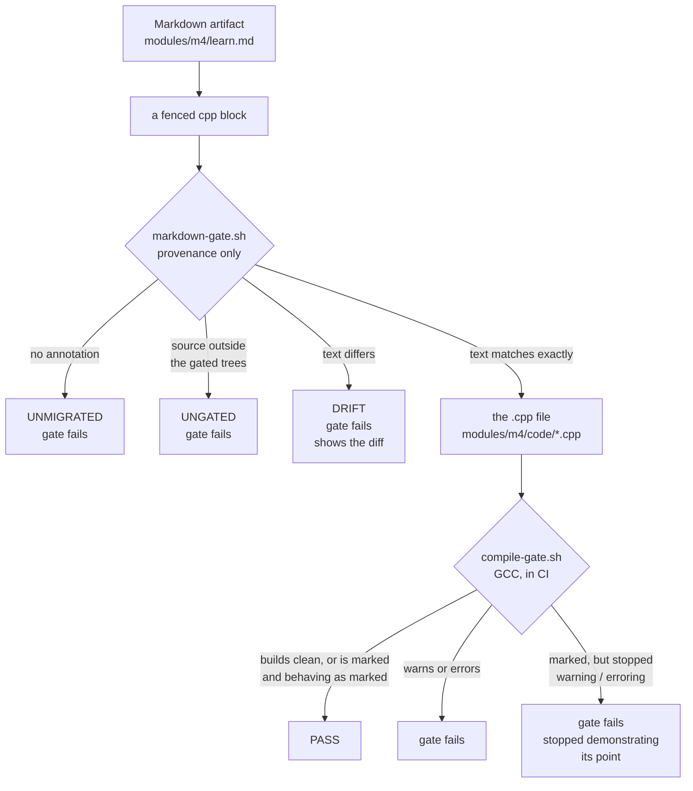

# The gates

Mechanical quality bar #1 says:

> Every C++ block in **every artifact** builds under `g++ -std=c++17 -Wall -Wextra`
> with zero warnings and zero errors.

Two scripts enforce it, and they do different jobs. Neither is sufficient alone.

| Script | Question it answers | Compiles? |
|---|---|---|
| `compile-gate.sh` | Does this `.cpp` build clean on the students' compiler? | yes |
| `markdown-gate.sh` | Is this fenced listing a faithful view of one of those `.cpp` files? | **no** |

Run both locally, exactly as CI runs them:

```bash
bash .github/scripts/compile-gate.sh
bash .github/scripts/markdown-gate.sh
```

## How they compose



The path a listing takes to `PASS` runs through **both** gates. That is the design:
the Markdown gate proves the page shows real code, and the compile gate proves that
code behaves as claimed. Neither script duplicates the other's work.

## Why the Markdown gate compiles nothing

The obvious design — extract every fenced block and compile it — does not survive
contact with the corpus. **Three quarters of the C++ blocks in this course are
deliberate fragments**: statements from inside `main` that use variables declared in
an earlier block, one-liners that are broken on purpose, "add the marked lines" diff
excerpts. Wrapping those in synthetic `main`s would gate code no student ever sees,
and would need an opt-out that quickly becomes the default.

So the Markdown gate asks a different question: not *does this compile*, but *is this
the same text as a file that already does*. See
[ADR-015](../../_lore/decisions/ADR-015-markdown-blocks-mirror-gated-source.md).

## The annotations

Declared on the fence's info-string — never in frontmatter, because a manifest keyed
by block index silently points at the wrong block the moment someone inserts one.

````markdown
```cpp source=modules/m4/code/learn-gate-strength.cpp
```cpp excerpt=modules/m4/code/apply-gatekeeper.cpp
````

- **`source=`** — the block is that **whole file**.
- **`excerpt=`** — the block **appears within** that file.
- An un-annotated `cpp` block **fails**. There is no skip.

No line numbers. `#L18-L44` breaks the moment anyone inserts a line above the slice,
and breaks *silently*. `excerpt=` matches by content, so unrelated edits to the source
can't break a match and edits to the quoted code always do.

Matching is exact text, **comments included** — a comment claiming a program "compiles
clean" is a claim about compiler behaviour, and four of those shipped in F-009. Two
rules soften it:

1. trailing whitespace is trimmed per line;
2. a line beginning `// ...` is an **elision**, matching zero or more source lines.

Rule 2 is how tail fragments are expressed, and it's the idiom M4's author already
used by hand.

## Blocks that are broken on purpose

They do not get a special Markdown annotation. They are an `excerpt=` of a `.cpp`
carrying a marker, and the **marker** asserts the behaviour:

```cpp
// GATE: EXPECT-WARNING   — this file must warn. If it stops warning, the gate FAILS.
// GATE: EXPECT-ERROR     — this file must not build. If it builds, the gate FAILS.
```

Both are **assertions, not mutes**. A marked file that quietly starts behaving has
stopped demonstrating the thing it exists for, and nothing about that looks wrong from
the outside — success and "never checked" are the same colour.

## Migrating a block

1. Find or create the `.cpp` it should mirror, under `_contracts/` or `modules/`.
2. Add `source=` (whole file) or `excerpt=` (part of one) to the fence.
3. Make the text match exactly. Run `bash .github/scripts/markdown-gate.sh` and fix
   what the diff shows.

**If the page deliberately trims the file's header comment**, use `excerpt=` and drop
the header from the listing. The block stays provably faithful to everything it does
show, and the page keeps its readability. This is the common case for M4.

For staged builds, each stage gets its own gated file (`-stage1.cpp`, `-stage2.cpp`,
…) — a stage is a shorter whole program, not a slice of the final one. That also turns
bar #9 ("each stage compiles and runs standalone") into something checked rather than
asserted.

## The dials

Environment variables, locally and as `workflow_dispatch` inputs in the Actions tab.

| Dial | Default | Applies to |
|---|---|---|
| `SEARCH_PATHS` | `_contracts modules` | both — accepts directories or single files |
| `CXX` | `g++` | compile gate |
| `CXX_STD` | `c++17` | compile gate |
| `WARN_FLAGS` | `-Wall -Wextra` | compile gate |
| `FAIL_ON_WARNING` | `1` | compile gate |
| `FAIL_ON_UNANNOTATED` | `1` | markdown gate |
| `GATED_PATHS` | `_contracts modules` | markdown gate — trees the compile gate covers |
| `VERBOSE` | `0` | both |

## Do not trust a local run on macOS

`g++` on macOS is **Apple clang**, which does not enable `-Wimplicit-fallthrough` under
`-Wextra`. GCC has since version 7. A local "clean" can be a warning for every student —
that is not hypothetical, it shipped inside a module certified Ready (F-009).

Quoting local output is fine. **Promising there was none is not.** Use real GCC
(`brew install gcc`, then `CXX=g++-16 bash .github/scripts/compile-gate.sh`) or read CI,
which is the authority (ADR-014).

The Markdown gate has no such caveat — it compiles nothing, so its result is identical
everywhere.

## The self-tests

A gate that cannot fail is not a gate, so both prove they still bite, on every run:

```bash
# the markdown gate: 8 fixtures, one per behaviour
bash .github/scripts/selftest/markdown/run.sh

# the compile gate: a fixture that must warn (GCC only — clang reports it clean)
SEARCH_PATHS=.github/scripts/selftest/must-warn.cpp bash .github/scripts/compile-gate.sh

# the EXPECT-ERROR marker, both directions
SEARCH_PATHS=.github/scripts/selftest/markers/expect-error-ok       bash .github/scripts/compile-gate.sh  # passes
SEARCH_PATHS=.github/scripts/selftest/markers/expect-error-violated bash .github/scripts/compile-gate.sh  # fails
```

The markdown fixtures matter more than usual right now: M4 ships **unmigrated**, so on
day one the convention gets no exercise from real material at all.

## Related lore

- [ADR-014](../../_lore/decisions/ADR-014-compile-gate-runs-on-gcc-in-ci.md) — the gate runs GCC in CI, and CI is the authority
- [ADR-015](../../_lore/decisions/ADR-015-markdown-blocks-mirror-gated-source.md) — fenced blocks mirror a gated source file
- [F-013](../../_lore/findings/F-013-markdown-blocks-are-unversioned-copies.md) — why identity and not similarity
