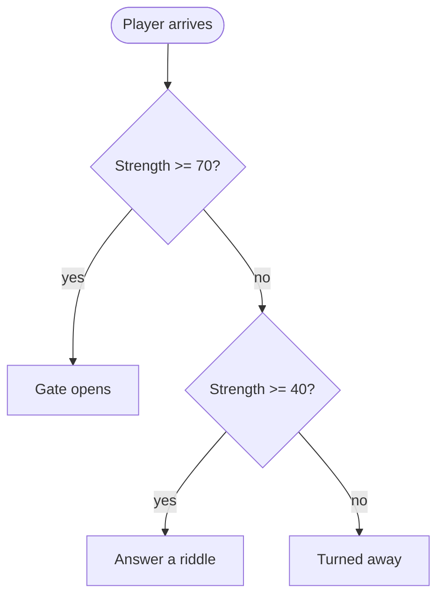

# Lab: The Dungeon Gatekeeper

*Module Four — Decisions (Assess)*

---

## The situation

A gatekeeper stands between you and the dungeon. She won't let just anyone through. She asks a couple of questions, looks you over, and decides — on the spot — what happens next. Pass, test, or turn away.

Your job: write a C++ program that **is** the gatekeeper. It asks the player a few things, weighs the answers, and picks an outcome. Different answers lead to different endings.

## Why we're doing this

This is selection — the program choosing a path based on a condition. It's the same "diamond" you drew in your Module 2 flowcharts, now made real in code. Every app that says "if the password is right, log in; otherwise, show an error" is doing exactly this.

You'll also practice a habit we use all term: **draw the plan first, then write the code.** The flowchart isn't busywork. It's how you find your mistakes before the compiler does.

## Step 1 — Draw the flowchart first

Before you write any C++, draw your decision logic as a **Mermaid flowchart** in a file called `gatekeeper-plan.md`. Show every question and every path. It doesn't have to be perfect — it has to be *yours*, and it has to match what your program actually does when you're done.

A tiny example of the shape (yours will be bigger):

## Step 2 — Write the program

Your program must:

1. **Ask the player for their class** — 1 = Warrior, 2 = Mage, 3 = Rogue.
2. **Ask for their strength score** — a whole number from 0 to 100.
3. **Use a `switch`** on the class to give a class-specific greeting.
4. **Use `if` / `else if` / `else`** to choose an outcome based on strength:
   - 70 or higher → the gate opens.
   - 40 to 69 → the gatekeeper poses a riddle (just print it — no answer needed for the C tier).
   - below 40 → turned away.
5. **Print the outcome** clearly, so the player knows what happened.

The player types their answers with `cin`. No loops yet — one pass through the questions is all you need.

## Theme is yours

The RPG theme is a default, not a rule. A nightclub bouncer checking IDs, an airport gate agent checking boarding passes, a bank approving a loan — any "someone decides whether you pass, based on conditions" story works. Keep the *decisions*; reskin the *story* however you like.

## Specifications

| Requirement | Detail |
|---|---|
| Plan file | `gatekeeper-plan.md` — your Mermaid flowchart |
| Program file | `M4LAB_gatekeeper_yourname.cpp` — lowercase, your name |
| Location | Your course repo, inside the `module-04` folder |
| Compiles | Cleanly under `g++ -std=c++17 -Wall -Wextra` — zero warnings |
| AI use | Allowed. Save your prompts in `prompts.md` in the same folder. |
| Due | See the course calendar |

## How it's graded — pick your tier

Each tier includes everything in the tier below it. Start at C and climb as far as you want.

| Tier | What it takes |
|---|---|
| **C — core** | Flowchart drawn. Program asks for class and strength, uses a `switch` for the greeting and `if`/`else if`/`else` for the outcome, and prints a clear result. Compiles clean. |
| **B — depth** | Add a **compound condition** using `&&`, `\|\|`, or `!`. Example: a Rogue *with a lockpick* (ask yes/no) may pass at strength 55 instead of 70. Also **check the input once** — if the class isn't 1–3 or strength is outside 0–100, print a clear message and end politely (no crash). |
| **A — synthesis** | Build a real branching tree: **four or more distinct endings** that depend on a mix of class, strength, and at least one item or choice. Nest your decisions so the path genuinely forks. |
| **Badge — above & beyond** | Commit a clean, final `gatekeeper-plan.md` that matches your finished code, a complete `prompts.md`, **and** a short reflection: where did you use `&&` vs. `\|\|`, and why? |

### The rubric (same four columns as every lab)

| Criterion | Points | What we're looking for |
|---|---|---|
| **Correctness** | 8 | The right outcome prints for the inputs given; conditions do what they claim |
| **Completeness** | 6 | Everything the chosen tier requires is present; the flowchart matches the code |
| **Format** | 3 | Readable code, helpful comments, clear output. Compiles clean under `-Wall -Wextra` |
| **Submission** | 3 | Right file names, right folder, right repo, committed; `prompts.md` present if AI was used |

No hidden criteria. What's on this page is the whole rubric.

## How to know you're done

- [ ] `gatekeeper-plan.md` shows your decision logic as a Mermaid flowchart
- [ ] `M4LAB_gatekeeper_yourname.cpp` is in `module-04` in your repo
- [ ] It compiles with **no warnings** under `g++ -std=c++17 -Wall -Wextra`
- [ ] You tested a **high**, a **middle**, and a **low** strength — and each gave the right ending
- [ ] (B+) You tested a **bad input** and the program handled it without crashing
- [ ] Your flowchart and your finished code tell the same story

## Fair warning

We will feed your gatekeeper strange answers. Strength of 999. Strength of -5. A class of 7. The letter "q" where a number should go. At the C tier that's allowed to misbehave — but at B and above, your program should notice and respond, not fall over. Test it *before* we do. Finding your own bugs is the whole skill.

---

*Instructor alignment (not shown to students)*

- **LPAA position:** this is the **Assess** beat for M4. Students arrive here after **Learn** (decisions reading), **Practice** (branch-tracing exit ticket), and **Apply** (instructor-led decision program typed in).
- **MLOs measured:** 4.1 (`if`/`else if`/`else`, `switch`) · 4.2 (boolean/comparison/logical operators — the B-tier `&&`/`||`/`!`) · 4.3 (flowchart → code, enforced by Step 1; the flowchart-matches-code check exercises the "recover a flowchart" half in reverse).
- **CLOs served:** CLO3 (selection/filters), with CLO1 (design-before-code, via the required flowchart) and CLO7 (test/debug, via the fair-warning testing culture) reinforced.
- **CCL:** "filters" — conditional processing of input.
- **Standards applied:** 10th-grade prompt readability; no hidden rubric; clean-compile bar in the Format column; tiered C/B/A/Badge from the shared template; `prompts.md` per the CSC AI ladder.
- **Sequence guard:** input validation here is a **single-pass** check (`if` + graceful exit), *not* loop-until-valid — that arrives in M5. Keeping it single-pass respects the decisions-before-loops order.
