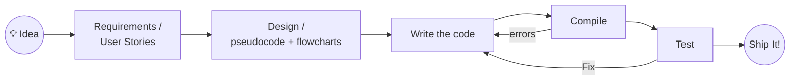

# CSC 134 — C++ Programming: Course Spine (Ground Truth Draft)

**Status:** Working spine for the overhaul — captures decisions through the shared-spine v0.3 proposal and the loops exemplar.
**Role in sequence:** Intro programming, C++. Sibling to CTI 110 (built in parallel, different teams). Both are front doors to the two-year Computer Programming & Development program.
**Working thesis:** This is not "intro to C++." It is *intro to solving problems with a machine that does exactly what you say* — using C++, the closer-to-the-metal instrument, to make that literalness visible.

---

## Audience (this drives real decisions)

CSC 134 is not CTI 110's audience. In practice it runs roughly **75% college-transfer (AS/AE — future CS and Engineering majors) and 25% programming-track (AAS).** Consequences that show up throughout this spine:

- The transfer majority is heading to four-year CS/engineering programs. The course serves them by building *foundations they'll be examined on later*, not job-ready IT skills. So M0's framing leans toward "why computation is foundational to your degree," and the compiled/typed nature of C++ is treated as a feature — it exposes machine reality they'll need.
- Preparation still varies widely. The **program-wide 10th-grade readability standard on prompts** applies here too: complexity lives in the *problem*, never in the prose describing it.
- "Filters," "pointers," and OOP are in our CCL and are not optional. This audience can handle them; the spine gives each a real home rather than a footnote.

---

## Design principles

1. **The computer is the literal robot.** Every bug is the gap between what you meant and what you said. C++ makes the gap *visible* — the compiler refuses ambiguity out loud, before anything runs. We use that.
2. **Comprehension precedes composition.** Students read and run working code before writing their own (PRIMM). The compiled toolchain and Runestone `thinkcpp` make the read-and-run beats concrete.
3. **Teach the assumed knowledge.** File management, plain text, version control, and "how to submit correctly" are curriculum, not prerequisites — same as CTI.
4. **Communication is a workforce skill.** Instructions, specs, user stories, commit messages, and defending working software are graded artifacts.
5. **AI is addressed early and honestly, with a C++-specific twist:** a stated course goal is *learn enough C++ to talk to an LLM assistant about C++ fluently.* You can't supervise code you can't read.
6. **Toolchain differences are teaching assets, not obstacles.** Compiled-vs-interpreted, Codespaces-vs-local, single-file convention — each is a lesson, not friction to hide.

---

## The three internal threads

Student-facing, there is **one** picture: the SDLC arc (below). Behind it, three content threads run through every module — our design vocabulary, shared with CTI:

| Thread | Carries in CSC 134 |
|---|---|
| **Concept** | State → selection → iteration → decomposition → data aggregation → objects (language-independent CS) |
| **Communication** | Markdown, flowcharts, specs, user stories, the prompt ladder, the Robot Sandwich |
| **Practice** | Codespaces/local VSCode, GitHub, the single-file convention, clean-compile discipline, trace tables |

---

## The organizing visual: the SDLC arc (shared with CTI)

Drawn day one, returned to constantly. The M8 capstone is "this arc, run once, end to end, by you."

Note the CSC-specific beat CTI's arc doesn't have: **Compile** sits between "write" and "test," and it loops back to "write" on its own. That extra node is the compiled toolchain earning its place in the picture — and it's exactly where the error taxonomy lives.

---

## The module delivery loop: LPAA (with PRIMM riding inside)

Every module runs the same four-beat rhythm. This is the shared **LPAA** loop, with our specific interpretation:

| Beat | In CSC 134 | PRIMM stage it carries |
|---|---|---|
| **Learn** | Short reading or video (often `thinkcpp` on Runestone), plus *predict the output before running* | **Predict** |
| **Practice** | Checkpoint / exit-ticket quiz — low-stakes, comprehension-focused, **completion-gated to proceed** | **Run + Investigate** (verify comprehension) |
| **Apply** | Instructor-led program tutorial: type the program in correctly, get it to compile and run. *Later modules open this up:* "here's 80% of the program — finish it." | **Investigate → Modify → (early) Make** |
| **Assess** | Traditional lab/homework: we give requirements + spec, students implement, test, and submit | **Make** |

**The key structural idea — the Make gradient.** PRIMM's comprehension-before-composition arc distributes across LPAA, and the *Apply* beat deliberately slides across the semester:

- **M2–M4:** Apply = type in 100% and get it running (pure Investigate/Modify).
- **M5–M7:** Apply = "here's 80%, finish the missing piece" (Modify → Make).
- **M8:** Apply = "here's a spec, go" (full Make).

Students are scaffolded *off* the scaffolding on purpose. By the capstone, the training wheels are gone because they were removed one module at a time.

---

## The problem-solving spine, pulled through the modules

| Stage | First introduced | Reinforced in |
|---|---|---|
| Understand the problem | M0 (why we're here) | M2, M8 |
| Decompose into steps | M1 (Robot Sandwich) | M2, M5, M6 |
| Represent the solution | M2 (flowcharts, user stories, pseudocode) | M4, M6, M8 |
| Implement precisely | M3–M7 (C++) | M8 |
| Verify against intent | M2 (did the program do what the spec said?) | M3 (first deliberate bug), M5 (trace tables), M8 |
| Communicate the result | M1 (Markdown, GitHub submission) | Every module; M8 presentation |

---

# The Modules

Nine modules across sixteen weeks. Module numbers are clean and supersede the current drifted numbering (see reconciliation note in *Sequencing*). Each module below gives its big idea, its LPAA breakdown, content, signature Assess artifact, spine connection, and the existing assets that slot into it.

---

## M0 — Welcome to Programming *(Phase A · ~Week 1)*

**Big idea:** Why are we even in this building, in front of computers? What is a program, what is this field, and why does this still matter when an AI can write code?

**Reframed for our audience.** The systems idea (software runs inside a system of people + processes + technology) is kept, but tilted toward the transfer majority: computation as the universal problem-solving instrument underneath CS and engineering. The AI stance is stated head-on in our terms — *AI can write C++; verifying and collaborating with it requires you to read C++, and building that fluency is an explicit goal of this course.* "Prompt and hope" is not an engineering skill.

**LPAA**
- **Learn:** read "Welcome to Programming" (short); what a program is; what this field is.
- **Practice:** exit ticket — what makes something a "program"? classify a few everyday systems.
- **Apply:** instructor-led environment setup — GitHub account, Codespaces vs. local VSCode + MinGW/MSYS2, "hello world" compiles and runs on *your* setup.
- **Assess:** a short reflection (a program you used today: its inputs, its process, its outputs) + proof the toolchain runs.

**Assets:** *Chapter 1 — Introduction to C++ Programming* (partial); toolchain guidance.

---

## M1 — Talk to Computers (and Your Team) *(Phase B · ~Weeks 1–2)*

**Big idea:** Plain text is the native language of both programming and professional collaboration. Precise instructions come *before* code.

**Content:** VSCode as a programmer's editor (vs. Word); the markup ladder `.txt → .md → .html`; GitHub's own Markdown docs as the authoritative reference; the pull → commit → push submission workflow; **Codespaces as the equalizer** (the only way to work for a student on a Chromebook — access is a design requirement, not a convenience).

**LPAA**
- **Learn:** Markdown reading; why it exists; why LLMs made it ubiquitous.
- **Practice:** exit ticket on Markdown syntax + the commit/push cycle.
- **Apply:** instructor-led — make a repo, write a real `README.md`, commit, push, preview it on GitHub.
- **Assess:** **the Robot Sandwich** (shared with CTI, adopted essentially unchanged — it contains no code). Rubric: Precision / Completeness / Format / Submission — the template every later rubric inherits.

**Spine connection:** Decomposition and precise communication, before any code exists to hide behind.

**Assets:** Robot Sandwich assignment (portable from CTI); the Robot-Sandwich explainer decks (linear + choose-your-own) as the Communication-thread hook.

---

## M2 — How to Solve Problems *(Phase C · ~Weeks 2–3)*

**Big idea:** Programming languages exist because natural language is ambiguous. And before *writing* code, we **read and run** it.

**Content:** why there are different languages (the **Hello World tour**: HTML/CSS → JS → Python → C++ → a slice of assembly — same output, different writing, because each was built to make a different thing easy); **compiler vs. interpreter made physical** (C++'s build step produces a file you can see; this is where the arc's Compile node comes alive); flowcharts in Mermaid; pseudocode; user stories ("As a ___, I want ___, so that ___"); and the **error taxonomy** introduced as four words used all term:

| Class | When it surfaces in C++ | Plain-language name |
|---|---|---|
| Syntax | at compile | "broke the grammar" |
| Static semantic | at compile | "grammar fine, meaning impossible" |
| Runtime | while running | "ran, then fell over" |
| Logic | never — it "works" | "did what you said, not what you meant" |

**LPAA**
- **Learn:** why-languages reading + Hello World tour; a first `thinkcpp` reading checkpoint (Predict the output).
- **Practice:** exit ticket — predict a program's output; classify a given error by taxonomy.
- **Apply:** instructor-led — compile and run a provided program, then **break it on purpose** and read the compiler's complaint together.
- **Assess:** receive a working C++ program; describe what it does in your own words; draw its flowchart. (Our version of CTI's "Perspective Flip.")

**Spine connection:** the module the course orbits — M8's rubric grades exactly these artifacts.

**Assets:** Runestone `thinkcpp` (reading checkpoints; functions coverage lands in Ch. 3, matching our functions module); the Communication decks.

---

## M3 — Program Basics *(Phase D · ~Weeks 3–4)*

**Big idea:** State — a program holds a changing world. Variables, types, I/O, arithmetic.

**Content:** variables and data types; `cin`/`cout`; arithmetic and expressions; the **single-file convention** introduced (we'll fill in prototypes-top / definitions-bottom once functions arrive in M6); meaningful names and comments as communication. **Debugging as curriculum:** the first error is a *planned, celebrated event* — we break a working program and read the compiler/runtime message together; failure is exercise, put in the reps.

**LPAA**
- **Learn:** `thinkcpp` / *Chapter 2* reading on I/O and expressions.
- **Practice:** exit ticket — trace an expression; predict I/O.
- **Apply:** instructor-led — type in an input → process → output program; get it building and running clean.
- **Assess:** a small I/O + arithmetic program from spec (the Pizza Calculator project slots here).

**CCL touch:** input/output operations; arithmetic operations.

**Assets:** *Chapter 2 — Input, Processing, and Output*; *Pizza Calculator* rubric; *Debugging Time — Fix These Broken Programs*.

---

## M4 — Decisions *(Phase D · ~Weeks 5–6)*

**Big idea:** Selection — the diamonds from M2's flowcharts, made executable.

**Content:** `if` / `else if` / `else`; `switch`; comparison and logical operators; nested conditions. This is where **"filters" (CCL)** begins — conditionally processing input. Assignments start from a flowchart and end in code; at least once, the reverse (read code, recover the flowchart).

**LPAA**
- **Learn:** *Chapter 4 / Module 03* reading.
- **Practice:** exit ticket — trace which branch runs for given inputs.
- **Apply:** instructor-led — type in a build-your-own-adventure decision program.
- **Assess:** a decision lab from spec (the CYOA theme carries the branching lesson twice — in the content *and* in the structure).

**CCL touch:** filters (selection over data).

**Assets:** *Chapter 4 — Decision Structures: Build Your Own Adventure*; *Module 03*.

---

## M5 — Loops *(Phase D · ~Weeks 7–8, the End Boss)*

**Big idea:** Iteration — repetition as a decomposition tool.

**Content:** `while`, `do-while`, `for`; input validation (the `cin` fail-state, bulletproofing); nested loops; the professional menu pattern. Verification gets real: **trace tables and predict-then-run.** The turtle bridge is the visual *Learn* anchor (a body that repeats + a count) before the numeric versions.

**LPAA**
- **Learn:** *Chapter 5 / Module 04* reading; the turtle square as the iteration anchor.
- **Practice:** exit ticket — predict loop output; spot the off-by-one.
- **Apply:** instructor-led — type in the **Level Up Stats** for-loop, get the table aligned; *then the Make gradient opens:* "here's 80% of the menu system — finish the validation loop."
- **Assess:** `M5LAB` loop fundamentals (while / for / array-search) + Project 2, the menu-driven game (tiered C/B/A).

**CCL touch:** iteration; filters (loop-and-select over streams).

**Assets:** *Chapter 5*; *Module 04 — Loops (GameFAQs)*; `M5LAB_A` (instructions, instructor guide, cheat sheet); the **Loops Two-Skin Exemplar** doc.

> **Buffer note:** Week 8 is the designated light buffer. Loops is the natural place to absorb it — the End Boss earns a breather.

---

## M6 — Functions *(Phase D · ~Weeks 9–10)*

**Big idea:** Decomposition made literal — the Robot Sandwich steps become named, reusable, testable units. Code is *revised*, not just written.

**Content:** defining and calling functions; the **single-file convention completed** (prototypes at top, `main` in the middle, definitions at the bottom); parameters, return values; **pass-by-value vs. pass-by-reference**; scope basics. Signature move: **refactor a prior M4 or M5 program into functions** — same behavior, better structure.

**LPAA**
- **Learn:** *Chapter 3 / Module 02* reading. *(Note: this content is authored as "Chapter 3" but is now delivered here, after loops — see sequencing.)*
- **Practice:** exit ticket — predict what a function returns; identify scope.
- **Apply:** instructor-led — extract functions from a monolithic program; "here's 80% — write the missing functions to match these prototypes."
- **Assess:** the refactor lab — take your M5 program and decompose it into functions.

**Assets:** *Chapter 3 — Functions: Breaking Down Problems Like a Pro Chef*; *Module 02 — Functions*.

---

## M7 — Structured Data & Objects *(Phase E · ~Weeks 11–13)*

**Big idea:** Aggregate data — and the struct→class arc. *A class is a struct that also has behavior.* OOP lands here, time-aligned with CTI's complex-data module.

**Content, as a deliberate progression:**
1. **Raw arrays** — declare, initialize, traverse; array/index vs. value.
2. **Parallel arrays** — used *intentionally as a stepping stone*, with in-code comments flagging the future refactor (making the evolution visible to students).
3. **Structs** — bundle related data; the parallel arrays collapse into one clean array of structs.
4. **Pointers** — introduced *in context, where they're motivated*: passing structs by reference, and the array/pointer relationship. Not a standalone unit.
5. **Classes / OOP** — encapsulation and methods; the struct grows behavior and becomes a class.

**LPAA**
- **Learn:** readings on arrays, structs, classes.
- **Practice:** exit tickets — array indexing (`i` vs `i+1`); struct member access; when a reference is needed.
- **Apply:** instructor-led — build a `Room` struct array; "here's 80% of the `Hero` class — finish the methods."
- **Assess:** the tiered `M7LAB1` — C: refactor parallel arrays into a `Room` struct array; B: add a `Hero` struct to teach pass-by-value vs. pass-by-reference; A: add a `Monster` struct with auto-resolve combat; then a class refactor.

**CCL touch:** arrays; pointers; object-oriented programming.

**Assets:** `M6LAB2` (parallel arrays → `Room` struct array); `M7LAB1` (structs, tiered); *Terminal Graphics for Codespaces and Windows* (richer output belongs here); *So Your Turtle Code Became Spaghetti* (a refactoring-mindset companion).

---

## M8 — Capstone Miniproject *(Phase F · ~Weeks 14–16)*

**Big idea:** The whole arc, run once, end to end, by you. The final exam is the spine *performed*.

**Structure**
1. **Problem formulation — front-loaded and graded heavily.** Problem statement, user stories, spec, flowchart — a **design document due before any code.** (Design documents before code is a standing practice for significant projects.)
2. **Implementation.** AI assistance permitted per our ladder; the student owns the problem definition and the verification. Built in **stages, each of which compiles and runs** as a standalone program.
3. **Presentation.** Demo working software; explain what it does, what decisions were made, and show it meets the spec.

**Theme:** the RPG/dungeon theme that ran all term pays off; the project builds on the structs and classes from M7.

**Assessment logic:** we grade the two things AI cannot do for you — *knowing what to build,* and *standing behind what you built.* This is the M0 framing cashed in: AI assistance is only as good as the problem formulation driving it.

**CCL touch:** design, code, test, and debug a C++ program (summative).

---

## Sequencing & the 16-week map

| Weeks | Module | Phase |
|---|---|---|
| 1 | M0 Welcome to Programming | A |
| 1–2 | M1 Talk to Computers | B |
| 2–3 | M2 How to Solve Problems | C |
| 3–4 | M3 Program Basics | D |
| 5–6 | M4 Decisions | D |
| 7–8 | M5 Loops *(Wk 8 = buffer)* | D |
| 9–10 | M6 Functions | D |
| 11–13 | M7 Structured Data & Objects | E |
| 14–16 | M8 Capstone | F |

**Sequencing decision (locked):** decisions and loops come **before** functions. This matches the shared spine and the working weekly rhythm.

> **Chapter/module drift — reconciliation.** Our authored chapter materials are *functions-first* (Chapter 3 = Functions, before Decisions/Loops), a legacy of the old order. The delivered sequence above puts functions in M6, after loops. **Action item:** re-label the chapter materials so the book and the calendar stop disagreeing — the Functions chapter content is correct, only its position/number moves. Existing lab filenames (`M5LAB`=loops, `M6LAB2`=arrays, `M7LAB1`=structs) should be audited against the clean numbering in the same pass.

---

## Assessment structure

- **Exit-ticket checkpoints** — one per module (the LPAA *Practice* beat), low-stakes, comprehension-focused, **completion-gated to proceed.** The gate is completion, not score. (Program-wide standard.)
- **Tiered rubrics — C / B / A / Badge** on labs, all descended from the Robot Sandwich's four columns (Correctness / Completeness / Format / Submission):
  - **C** — core competency demonstrated.
  - **B** — added depth or a second concept.
  - **A** — synthesis or extension.
  - **Badge** — documentation/reflection above and beyond (e.g., a complete `prompts.md`, a hand-drawn trace table).
- **Clean-compile bar:** the *Format* column for any C++ tier requires a clean build under `g++ -std=c++17 -Wall -Wextra` — zero warnings is a stated quality bar.
- **No trick questions** — stated policy. Assessments verify the objectives, not stamina or lawyer-reading.
- **M8 capstone** as the summative performance assessment (formulation + presentation weighted heavily).

---

## Delivery standards (program-level, applied here)

- **10th-grade readability** on all student-facing prompts. Complexity lives in the problem, not the prose.
- **Mermaid-in-Markdown** as the standard flowchart format — renders natively on GitHub, reuses M1 skills.
- **No trick questions**, stated to students.
- **Exit-ticket completion gates** between modules.

---

## AI collaboration policy (CSC's own ladder — kept, not merged with CTI's)

We maintain a **separate** AI ladder from CTI, on purpose, because CSC carries a goal CTI doesn't: *learn enough C++ to talk to an LLM assistant about C++ fluently.* AI use is a **taught skill**, not a shortcut suppressed or waved through.

- **Prompt patterns taught explicitly:** Scaffold, Explain-Then-Generate, Refactor, Debug, Review.
- **Citation:** AI use is logged in a `prompts.md` in the repo (a Badge-tier expectation, honesty everywhere).
- **Failure modes taught:** students are shown where AI confidently produces wrong C++, so they learn to supervise it.
- **The prompt ladder** (Markdown → spec → user story → prompt) frames prompting as spec-writing for a literal reader — the same skill as instructing the compiler.
- **Open:** the exact point at which AI assistance moves from gray-zone to officially permitted per module. Currently permitted-and-logged on labs; formally owned at the capstone (Assess). To be pinned down in the AI ladder companion doc.

---

## Toolchain & conventions

- **Environments:** GitHub Codespaces (primary) and local VSCode + MinGW/MSYS2 on Windows. GitHub for all submission. Taught side by side; Codespaces framed as "the same editor when the machine isn't yours."
- **Compiler standard:** `g++ -std=c++17 -Wall -Wextra`; clean compile, zero warnings, is a quality bar.
- **Single-file convention:** prototypes at top, `main` in the middle, definitions at the bottom. No multi-file projects in this course (that inheritance is flagged forward for later courses).
- **Staged builds:** demos and instructor examples are built in stages; each stage compiles and runs standalone, so complexity accumulates visibly.
- **Runestone `thinkcpp`:** completion-graded reading checkpoints feeding the *Learn/Practice* beats. Runestone's instructor dashboard is the source of truth for completion; Canvas LTI integration is treated as optional. Known gaps we pick up ourselves: thin for-loop coverage, late file I/O, no raw arrays, and no interactive `cin` in C++ ActiveCode (so Runestone handles tracing/prediction; Codespaces handles interactive programs).

---

## CCL crosswalk (compliance anchor)

CCL: *"introduces object-oriented computer programming using the C++ programming language. Topics include input/output operations, iteration, arithmetic operations, arrays, pointers, filters, and other related topics. Upon completion, students should be able to design, code, test, and debug C++ language programs."*

| CCL element | Where it lives |
|---|---|
| Input/output operations | M3 (core); reinforced everywhere |
| Iteration | M5 |
| Arithmetic operations | M3 |
| Arrays | M7 |
| **Pointers** | M7 (folded in with structs, motivated by pass-by-reference) |
| **Filters** | M4 (selection over data) → M5/M7 (loop-and-select over streams/collections) |
| **Object-oriented** | M7 (struct → class) + M8 (built on classes) — *genuinely covered* |
| Design, code, test, debug | Whole spine; debugging as curriculum from M3; M8 summative |

---

## Existing assets — what we have and where it goes

| Asset | Slots into |
|---|---|
| Chapter 1 — Intro to C++ | M0 (partial) |
| Chapter 2 — Input/Processing/Output | M3 |
| Chapter 3 / Module 02 — Functions | **M6** (content correct, position moves) |
| Chapter 4 / Module 03 — Decision Structures | M4 |
| Chapter 5 / Module 04 — Loops | M5 |
| Debugging Time — Fix These Broken Programs | M3 onward |
| Pizza Calculator project | M3 (Assess) |
| `M5LAB_A` (loops) | M5 (Assess) |
| Loops Two-Skin Exemplar | M5 (Apply/Assess) |
| `M6LAB2` (parallel arrays → struct) | M7 |
| `M7LAB1` (structs, tiered) | M7 (Assess) |
| Terminal Graphics guide | M7 (richer output) |
| So Your Turtle Code Became Spaghetti | M6/M7 (refactoring mindset) |
| Robot Sandwich + explainer decks | M1 |
| Runestone `thinkcpp` | Learn/Practice, M2–M6 |

---

## Open questions (parked, not blocking)

1. **Shared-artifact ownership** (with CTI): who owns the Robot Sandwich, the error-taxonomy card, and the rubric template, and in which repo, so a fix reaches both courses? *(Shared open item #6.)*
2. **Phase labels vs. module numbers** as the canonical reference, and the chapter-renumbering pass that comes with resolving it. *(Shared open item #7.)*
3. **Input validation as a taught beat** — it appears in M5+ rubrics; confirm it has an explicit instructional moment *before* it's graded (it must be taught, not assumed).
4. **The AI-permission line per module** — where gray-zone becomes officially permitted; to be settled in the AI ladder companion doc.
5. **`thinkcpp` fork-or-adopt** — after the spike produces reading-completion data, decide whether to keep adopting as-is or fork to close the known gaps.
