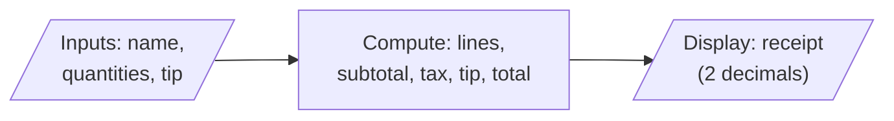

# M3LAB2: The Taco Receipt

## The Mission

Taqueria La Terminal needs a register program. It takes an order, does the math, and prints a receipt.

Sounds easy. Here's the catch: by the end of this lab you will watch a receipt that is **off by one penny**, printed by a program with no bugs in it. Explaining that penny is the real assignment. This is your first look at one of the biggest ideas in programming: **what a variable holds and what the screen shows are not the same thing.**

## Specification

**Inputs** (in this order):
1. Customer name (may contain spaces)
2. Quantity of each menu item (whole numbers)
3. Tip percent (B tier and up)

**Menu** (store these as `const double`):

| Item | Price |
|---|---|
| Taco al pastor | $3.29 |
| Taco de carnitas | $3.79 |
| Chips & salsa verde | $2.85 |
| Horchata (large) | $2.60 |

Sales tax is **7%** (Cumberland County, NC), also a named constant.

**Processing:** subtotal = each quantity times its price, added up. Tax = subtotal × 0.07. Tip (B tier) = subtotal × (tip percent ÷ 100) — **tip is figured on the subtotal, before tax.** Total = subtotal + tax (+ tip at B tier and up).

**Output:** a receipt. All money shows exactly two decimal places (`fixed` and `setprecision(2)` from `<iomanip>`).

> **Order of prompts matters:** ask for the name FIRST, before any numbers. (Moving it after the numbers breaks in a way you'll learn to fix in Module 5. For now, name first.)

## Requirements by Tier

### C Tier — A Receipt That Adds Up
- All four prices and the tax rate are `const double` with meaningful names
- Reads the customer name with `getline`, then the four quantities
- Computes subtotal, tax, and total
- Prints a labeled receipt with every money amount at exactly 2 decimal places
- Compiles clean: `g++ -std=c++17 -Wall -Wextra`, **zero warnings**

### B Tier — Make It Look Like a Receipt (everything in C, plus...)
- A line for each item showing quantity and line total (quantity × price)
- Columns aligned with `setw`, `left`, and `right` — item names lined up on the left, money lined up on the right
- An order number (a `const int`) in the header
- Asks for a tip percent; prints the tip line; total includes the tip

### A Tier — The X-Ray (everything in B, plus...)
- After the receipt, print a **MACHINE X-RAY** block: the *same* subtotal, tax, tip, and total variables, printed again with `setprecision(17)`
- Run your program with the **Penny Mystery order**: 5 pastor, 0 carnitas, 1 chips, 2 horchata, 15% tip. Look at the tax and tip lines on the receipt, then look at the X-ray.
- In a comment block at the top of your file, answer in 3–5 of your own sentences: *The receipt and the X-ray printed the same variables but different digits. Which one is closer to the value the machine actually holds? Where did the penny go?*

### Badge — The Penny Report
- `prompts.md`: every AI prompt you used and what you changed about the answers (honesty, not volume)
- `PENNY_REPORT.md` (150–250 words): find a real receipt from your life and check its math. Then explain how real cash registers avoid the penny problem. (Hint: many of them never use a `double` for money at all.)

## Sample Runs

**C tier** (typed input shown after each prompt):

```text
Welcome to Taqueria La Terminal!
Name for the order: Ada Lovelace
Tacos al pastor ($3.29 each): 3
Tacos de carnitas ($3.79 each): 2
Chips & salsa verde ($2.85 each): 1
Horchata, large ($2.60 each): 2

------ TAQUERIA LA TERMINAL ------
Order for: Ada Lovelace
Subtotal: $25.50
Tax (7%): $1.79
Total:    $27.29
Gracias, come again!
```

Check it yourself: 25.50 + 1.79 = 27.29. This one adds up.

**A tier, the Penny Mystery order:**

```text
Welcome to Taqueria La Terminal!
Name for the order: Grace Hopper
Tacos al pastor ($3.29 each): 5
Tacos de carnitas ($3.79 each): 0
Chips & salsa verde ($2.85 each): 1
Horchata, large ($2.60 each): 2
Tip percent (like 15): 15

======================================
       TAQUERIA LA TERMINAL
   Order #42  for  Grace Hopper
======================================
ITEM                   QTY    AMOUNT
--------------------------------------
Taco al pastor           5    16.45
Taco de carnitas         0     0.00
Chips & salsa verde      1     2.85
Horchata (large)         2     5.20
--------------------------------------
Subtotal                      24.50
Tax (7%)                       1.72
Tip                            3.67
TOTAL                         29.89
======================================
        Gracias, come again!

---------- MACHINE X-RAY ----------
(the same variables, shown with setprecision(17))
subtotal = 24.50000000000000000
tax      = 1.71500000000000008
tip      = 3.67499999999999982
total    = 29.89000000000000057
-----------------------------------
```

Two things to stare at. **The tip:** 15% of $24.50 is $3.675 — schoolbook rounding says $3.68, but the receipt says $3.67. **The tax:** 7% of $24.50 is $1.715, and it rounded *up* to $1.72. Same rule, opposite results. The X-ray shows why: the machine never held 3.675 or 1.715 at all. It held the nearest values a `double` can store — one lands a hair below, one a hair above.

## Design First

Before you code, sketch the flow. It's a straight line — that's the point of this module:



Notice the last box says **display**, not "the answer." The variables hold the values; the receipt is a *picture* of them.

## Getting Started

```bash
g++ -std=c++17 -Wall -Wextra -o m3lab2 m3lab2.cpp
./m3lab2
```

Zero warnings is the bar. A warning fails the Format column.

## Testing Your Work

- The C-tier sample order (3, 2, 1, 2): does your receipt match ours to the penny?
- All zeros: does the receipt print $0.00 everywhere without falling over?
- The Penny Mystery order (5, 0, 1, 2, tip 15): does your subtotal + tax line math disagree with your total by one cent? **It should.** If it doesn't, check that you computed tax from the subtotal *variable*, not from a re-typed number.
- Type `three` instead of `3` for a quantity and watch what happens. Don't fix it — you don't have the tools yet (that's Module 5). Just notice which *kind* of error it is.

## Troubleshooting

### It won't compile (syntax / static semantic)
- **`'setw' was not declared in this scope`** — static semantic: you used a tool without introducing it. Add `#include <iomanip>`.
- **`expected ';' before 'cout'`** — syntax: the missing semicolon is almost always on the line *above* the one the compiler names.

### It compiles but prints strange numbers (logic — display kind)
- **`Total: $27` or `Total: $2.7e+01`** — you used `setprecision(2)` without `fixed`. Without `fixed`, setprecision counts *total digits*, not decimal places. This is the representation/display lesson charging you rent.
- **Money shows one decimal, like `$25.5`** — `fixed << setprecision(2)` hasn't been applied before that line.

### It runs but skips the name, or loops garbage (runtime)
- **Name prompt gets skipped** — you moved `getline` after a `cin >>`. Put the name first (see Specification). The real fix arrives in Module 5.
- **Typed a word where a number goes and everything went sideways** — `cin` fail state. Runtime error class. Module 5 teaches the bulletproofing; today, numbers only.

### The receipt is off by a penny (logic?)
- Not a bug. That's the assignment. Explain it in your A-tier comment instead of "fixing" it.

## Submission

1. Pull first: `git pull`
2. Confirm a clean build: `g++ -std=c++17 -Wall -Wextra -o m3lab2 m3lab2.cpp` (zero warnings)
3. Commit: `git add m3lab2.cpp` then `git commit -m "M3 Lab 2: receipt works, X-ray explained"`
4. Push: `git push`
5. Check on github.com that your file is there. If you can't see it, neither can your instructor.

Going for the Badge? Also commit `prompts.md` and `PENNY_REPORT.md`.
