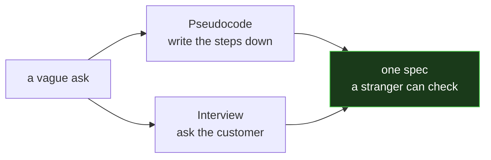

# Running the bases — the seam between pseudocode and the interview

A student who can write pseudocode and a student who can interview a customer are not
the same student, and the course currently teaches neither one all the way. This exemplar
is the seam between them.

## The two routes

Both routes start at a vague ask and end at a spec someone else could build from.

**Pseudocode is strong on order, weak on purpose.** It forces you to say what happens
first, what happens next, and what happens when the input is wrong. It never asks who the
program is for, and it will never tell you that the thing you are about to build breaks
something already standing.

**The interview is strong on boundaries, weak on order.** A few questions get you the scope
and the shape. It will leave a loop's exit condition unwritten forever.

> **Corrected by measurement, 2026-08-06.** This section used to say the interview gets you
> *the audience* in two questions. [[F-022-split-picture-rail-calibration]] measured that and
> it is false. Across two interviewing rails and twenty questions, **not one asked who else
> reads the page** — because the repo already answers it, so the question reads as settled.
> **Audience is the unreliable base on both rails.** Ask it out loud even when you think you
> know.

Neither route is the spec. **The spec is what survives both.**

That is why the four bases — Audience, Scope, Format, Path — are a *test* rather than a
route. You run them against what you produced, from whichever direction you came.

## It is a heuristic

Clearing all four bases means a capable reader gets it right the first time, **more than
half the time.** More than half. You still check the result.

The course already runs on one four-item heuristic — Syntax, Static semantic, Runtime,
Logic — and nobody claims those four catch every bug. Same honesty here. A checklist that
promised certainty would be teaching the wrong lesson about specifications, which is that
they are a bet you can inspect, not a proof.

## What is here

| File | What it is |
|---|---|
| `../../../.claude/skills/running-the-bases/SKILL.md` | The procedure. Invocable — the fleet runs it, it is not read *about* |
| `BRIEF.md` | The reusable form. Copy it per deliverable |
| `WORKED.md` | One real deliverable taken through both routes, including where each route strands |
| `assay-journal.md` | Read-only findings from pointing the floor test at documents this repo already had |

The skill came first and produced the rest. That ordering is the claim: a procedure that
cannot generate its own worked example is a description, not a procedure.

## Where it sits in the course

The spine promises a prompt ladder — Markdown → spec → user story → prompt — and frames
prompting as "spec-writing for a literal reader, the same skill as instructing the
compiler." That ladder is **spine open item #4** and is not implemented anywhere in
`modules/`. This exemplar is a candidate answer, not a ruling.

Two things it is deliberately not:

- **Not a sixth prompt pattern.** The five are Scaffold, Explain-Then-Generate, Refactor,
  Debug, Review. The bases are a floor test you apply *before* choosing one.
- **Not student-facing yet.** It lives in `_storming/`. Moving any of it into `modules/`
  is a spine ruling, and it would land on a real gap: `modules/m2/learn.md` does not
  contain the word "pseudocode" though MLO 2.2 requires it, and the
  `As a… I want… so that…` form first appears in M8 while being described there as long
  taught. **Both rails of this seam are currently unauthored.**
