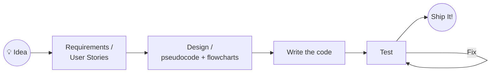

# CTI 110 — IT Fundamentals: Course Spine (Ground Truth Draft)

**Status:** Brainstorm draft for instructional realignment — Computer Programming & Development
**Role in sequence:** Funnel entry. Feeds both the Programming path (→ CSC 121 → CSC 221 → capstones) and the IT path.
**Working thesis:** This is not "intro to Python." It is *intro to solving problems with systems*, using Python as the primary instrument.

---

## Design Principles

1. **Systems, not just technology.** A system is people + processes + technology. Every module returns to this framing (the supermarket self-checkout is useless without stockers).
2. **Problem-solving is the spine.** Decompose → represent → implement → verify → communicate. Python modules are reps of this cycle, not the point of the course.
3. **Teach the assumed knowledge.** File management, plain text, version control, and "how to submit work correctly" are curriculum, not prerequisites.
4. **Communication is a workforce skill, not a soft skill.** Writing instructions, user stories, commit messages, and presenting working software are graded artifacts.
5. **AI is addressed head-on, early, and honestly.** The course answers "why not just let the AI do it?" in week one and then *proves the answer* across the semester. (See companion doc: AI Assistance Ladder.)
6. **PRIMM is the instructional model for code.** Predict → Run → Investigate → Modify → Make (Sentance et al.). Students read and run working code before they write it (M2), then progress through modification (M3–M5) toward independent creation (M6–M8). Comprehension precedes composition.

---

## The Organizing Visual: The SDLC Arc

The course is framed for students as one pass through the software development lifecycle, drawn on day one and returned to constantly:

**Module mapping onto the arc:**

| SDLC stage | Modules | Tooling |
|---|---|---|
| Idea → Requirements / User Stories | M2 | Markdown (from M1) |
| Design (flowcharts, pseudocode) | M2, reinforced M4–M6 | Mermaid in Markdown — GitHub renders it natively |
| Write the code | M3–M7 | VS Code (M1); Codespaces (open question, see below) |
| Test ↔ Fix | M5 onward (trace tables, predict-then-run) | — |
| Ship It! | M8 | Presentation of working software |

The M8 miniproject is explicitly framed as "the arc, run once, end to end, by you."

---

## The Problem-Solving Spine (pulled through every module)

| Stage | First introduced | Reinforced in |
|---|---|---|
| Understand the problem | M0 (systems framing) | M2, M8 |
| Decompose into steps | M1 (robot sandwich) | M2, M5, M6 |
| Represent the solution | M2 (flowcharts, user stories) | M4, M6, M8 |
| Implement precisely | M3–M7 (Python) | M8 |
| Verify against intent | M2 (did the robot make a sandwich?) | M5, M7, M8 |
| Communicate the result | M1 (markup, GitHub submission) | Every module; M8 presentation |

---

## Module Zero — Welcome to IT

**Big questions:** What is Information Technology? What is a system? Why not just let the AI do it?

**Framing content**
- IT as a field: roles, paths, and where this course leads (programming vs. IT track).
- Systems = people + processes + technology. Anchor example: automated supermarket checkout — remove the humans stocking shelves and the "technology" is a kiosk in an empty room.
- **The Unstated Question, stated:** If you're not going into IT, fine — no argument here. If you *are*: verifying whether the AI even understood the problem requires you to understand the problem. "Prompt the AI and hope" is not a hiring profile. Even if your ambition is to have AI do your job, that ambition *requires this material.*

**Mechanical skills (the assumed knowledge)**
- Zip/unzip archives; file extensions; where files actually live on disk.
- Create a GitHub account; navigate a repo in the browser.
- Course logistics, LMS navigation, how work is submitted.

**Artifact:** GitHub account created; a short "What is a system?" reflection identifying the people, processes, and technology in a system the student uses daily.

---

## Module One — Talk to Computers (and Your Team)

**Big idea:** Plain text is the native language of both programming and professional collaboration.

**Content**
- VS Code as a *programmer's text editor* — what that means vs. Word.
- The markup ladder: `.txt` → `.md` → `.html`. Same content, increasing structure; why each format exists and who consumes it.
- GitHub's own Markdown documentation as the authoritative reference (students learn to read vendor docs, not just handouts).
- **GitHub Codespaces as the equalizer environment.** Local VS Code and Codespaces are taught side by side; Codespaces is framed as "the same editor, when the machine isn't yours." Rationale: for some students (e.g., a Chromebook at home), Codespaces is the *only* way to work on code outside the lab. Access is a design requirement, not a convenience.
- Getting, editing, creating, and **correctly submitting** text files via GitHub.
- **Version control scope (this course):** the GitHub website, and possibly GitHub Desktop, sufficient to pull → commit → push. Students are told plainly: on a real team there is more to it — Issues and Pull Requests arrive in later courses. The forward pointer is explicit so CSC 121 knows what it inherits.

**Signature assignment:** *Robot Sandwich.* Write instructions for a robot to make a sandwich. Instructions must be uploaded to GitHub in the correct format and location. Assessed on precision, completeness, and correct submission — a preview of both algorithms (M2) and code review culture.

**Spine connection:** Decomposition and precise communication, before any code exists to hide behind.

---

## Module Two — How to Solve Problems

**Big idea:** Programming languages exist because natural language is ambiguous. Before code, we have representations. And before *writing* code, we **read and run** code.

**Opening move — don't start with writing code:** Students receive a complete, simple, working Python program. Their job: run it, then describe what it does *in their own words*. Comprehension before composition. (This is the front half of the PRIMM model — Predict, Run, Investigate, Modify, Make — a well-established CS education framework worth citing in the realignment documentation. M3–M7 complete the Modify/Make half.)

**Content**
- Why programming languages exist; a brief tour of the landscape (and why this course uses Python).
- Flowcharts (rendered in Mermaid — reuses the Markdown skills from M1; GitHub renders them natively in the same repo workflow).
- Pseudocode as the design-stage representation between flowchart and Python.
- User stories: "As a ___, I want ___, so that ___."
- Decomposition strategies; inputs → process → outputs.
- The curiosity frame: consumer experience vs. **"developer experience"** — cultivating the habit of asking *how does this work behind the screen?*

**Signature assignment:** *The Perspective Flip.* Take a consumer experience (an Uber ride, an Amazon purchase). First, **understand the existing consumer act**: list the steps as the consumer sees them. Then **decompose into steps** from the builder's side: re-describe the same experience as someone *developing* that system — actors, data, decision points, failure cases. Deliver as user stories + a Mermaid flowchart, committed to GitHub.

**Spine connection:** This is the module the whole course orbits. M8's rubric grades exactly these artifacts.

---

## Module Three — Python Basics

**Content:** Variables, data types, input/output, expressions, running scripts (in VS Code, not a toy sandbox).

**Debugging as curriculum, not accident:** The first error message is a *planned, celebrated event* — we break a working program on purpose and read the traceback together. Framing: **failure is exercise; put in the reps.** Diagnostic conversation follows the department's FIGURE process (the structured questions that get a student to elicit an actual problem statement), and the Test↔Fix loop from the SDLC arc is practiced from here forward.

**Spine connection:** Implementation begins. Every program starts from a stated problem, not a code prompt — even "convert Fahrenheit to Celsius" gets a one-line problem statement and expected outputs *before* code.

**Workforce thread:** Meaningful file names, comments as communication, committing work with sensible messages.

---

## Module Four — Python Branches

**Content:** Booleans, comparison and logical operators, `if`/`elif`/`else`.

**Spine connection:** Branches are decision points — the diamonds from M2 flowcharts made executable. Assignments start from a flowchart and end in code (and at least once, the reverse: read code, recover the flowchart).

---

## Module Five — Python Loops

**Content:** `while`, `for`, iteration patterns (counting, accumulation, sentinel, validation).

**Spine connection:** Repetition as a decomposition tool. Verification gets real here: trace tables and predicting output before running.

---

## Module Six — Functions

**Content:** Defining and calling functions, parameters, return values, scope basics.

**Big idea:** Functions are decomposition made literal — the robot-sandwich steps become named, reusable, testable units.

**Spine connection:** Refactor a prior assignment (M4 or M5) into functions. Same behavior, better structure — introduces the idea that code is *revised*, not just written.

---

## Module Seven — Structured Data

**Content:** Lists and dictionaries; reading/writing simple data; then **recapitulation with sqlite3**.

**Signature project:** *Car MPG.* Model vehicle fuel-economy records as Python dictionaries; compute and report on them. Then rebuild the same project with sqlite3 as the store.

**Deliberate positioning:** SQL is introduced *as a tool used from within Python*, not as a separate track. This keeps programming-path students on task while still delivering "I have used a database" as a workforce claim. (Full SQL depth is deferred to later coursework.)

**Spine connection:** Same problem, two representations — reinforces that the representation is a choice, and the problem definition is what persists.

---

## Module Eight — Programming Miniproject

**Big idea:** The final exam is the whole spine, run once, end to end.

**Structure**
1. **Problem formulation (front-loaded, graded heavily):** problem statement, user stories, spec, flowchart. Due *before* implementation begins.
2. **Implementation:** AI assistance permitted (see AI Assistance Ladder). The student owns the problem definition and the verification.
3. **Presentation:** Physically present working software. Explain what it does, what decisions were made, and demonstrate that it meets the spec.

**Assessment logic:** We grade the two things AI cannot do for you — knowing what to build, and standing behind what was built. This is the payoff of the Module Zero framing: the student experiences firsthand that AI assistance is only as good as the problem formulation driving it.

---

## Assessment Structure (SETTLED)

- **Checkpoint quizzes as exit tickets** — one per module, low-stakes, comprehension-focused, **must complete to proceed** to the next module. The gate is completion, not score.
- **Two tests only: midterm and final** (simplified). The in-module gating made additional tests redundant.
- **NO TRICK QUESTIONS.** Stated as policy, told to students. Tests verify the objectives, not stamina or lawyer-reading.
- **M8 miniproject** as the summative performance assessment (formulation + presentation weighted; see AI Assistance Ladder Rung 4).

## Delivery Standards

- **Prompt cues at ~10th-grade reading level.** Assignment prompts and instructions are written to a 10th-grade readability target. This is a funnel course serving students of widely varying preparation; complexity should live in the *problem*, never in the prose describing it.
- **Mermaid diagrams in Markdown** as the standard flowchart format — renders natively on GitHub, zero extra tooling, reuses M1 skills.

## Timeline

- **Refresh complete by 8/1** for the fall term.

---

## CCL Crosswalk (compliance anchor)

Latest CCL description: *"This course provides an introduction to technology concepts and current trends in IT. Topics include foundational concepts across various IT domains such as, but not limited to, artificial intelligence, database fundamentals, programming principles, and web development. Upon completion, students should be able to demonstrate knowledge in core IT areas and apply skills critical for their academic and professional success."*

| CCL element | Where it lives in the outline |
|---|---|
| Technology concepts & current trends | M0 (What is IT? What is a system?), AI framing throughout |
| **Artificial intelligence** | M0 (the Unstated Question), AI Assistance Ladder rungs across all modules, M8 (AI-collaborative development) — *genuinely covered, not checkbox-covered* |
| **Database fundamentals** | M7 (dictionaries → sqlite3 recapitulation) |
| **Programming principles** | M2–M8 (the spine itself) |
| **Web development** | M1 markup ladder (.txt → .md → .html) — **thinnest mapping**; see note |
| Demonstrate knowledge / apply skills | M8 miniproject + presentation; exit-ticket gates |

**Web dev note:** the "not limited to" language gives latitude, but the cheapest honest strengthener is publishing M1's HTML via **GitHub Pages** — one settings toggle, students get a real URL they made, and "web development" becomes demonstrable rather than nominal. Recommended.

---

## Open Questions (for the realignment discussion)

1. **The IT-track half of the funnel:** M3–M7 are Python-heavy. What does the IT-bound student carry out of those modules — is the framing "problem-solving reps that happen to use Python," and is that stated to them explicitly in M0?
2. **Where does M2 get re-assessed?** Recommend a small "spec-first" gate on at least one assignment in M5 or M7 so the M8 front-load isn't the first time since M2 they've written a user story.
3. **PARKED — Gating stall-out tripwires.** Known current pattern: students stall on "the last program they didn't know how to write," and the stall-out is large. Exit-ticket gating turns this invisible-stall into visible telemetry. Candidate tripwires to discuss: N days without gate progress → automated nudge; N+M days → instructor contact; repeated exit-ticket attempts without completion → flag for FIGURE-style intervention. Revisit as a team.
4. **PARKED — Success metrics for the refresh.** Candidates: DFW rate vs. prior years; per-gate survival curve (especially the M4→M5 loops cliff); progression rate into CSC 121; exit-ticket completion velocity. Decide before fall so this year is a clean baseline.
