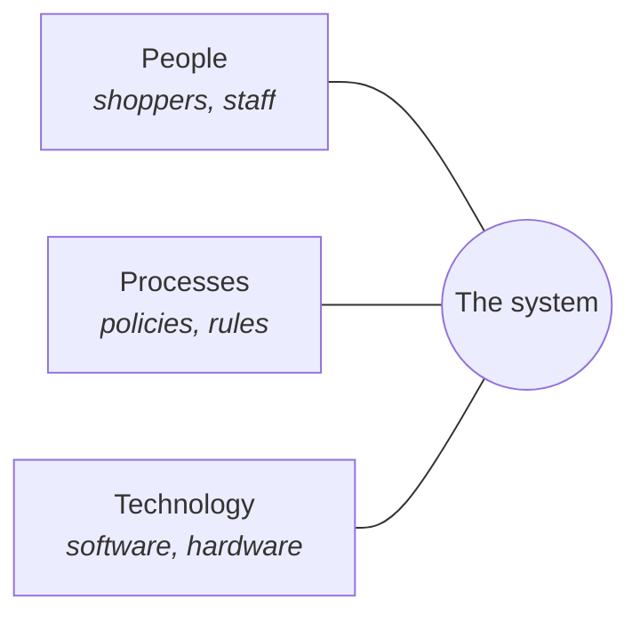

# Welcome to Programming: Three Questions Before the First Line of Code

## Learning Objectives

By the end of this reading, you will be able to:

- **Say** what a program is in your own words, and **point at** one running in an everyday system (MLO-0.1).
- **Describe** any program you used today in terms of its **inputs**, its **process**, and its **outputs** — the frame this module's assignment is graded on.
- **Explain** how software sits inside a system of **people, processes, and technology**, not just inside a machine (MLO-0.1).
- **State the course's AI position in your own words**: AI can write C++; verifying it and collaborating with it requires you to read C++ (MLO-0.4).
- **Name** the two ways you can get a working C++ toolchain, and why the course supports both.

## Why This Matters

You are in this room for a reason that is worth saying out loud on day one, because it is not obvious and the answer has genuinely changed in the last few years.

This module asks three questions:

1. **What is a program?**
2. **What is this field?**
3. **Why does any of this still matter when an AI can write code?**

The third one is the honest question, and this course answers it head-on rather than hoping you do not ask. You will not write C++ today. You will not write C++ next module either — **M1** is about talking precisely to computers *and to people*, and **M2** is where the first program shows up. Today is the why.

## The Core Concept

### One: what a program actually is

A **program** is a set of instructions precise enough that a machine can follow them without guessing.

That is the whole definition, and the load-bearing word is **guessing**. People fill gaps automatically — tell someone "grab the door" and they work out which door, how hard, and which hand. A machine fills nothing. Whatever you left out stays out.

Every program, no matter how large, has the same three parts:

| Part | What it means | Self-checkout example |
|---|---|---|
| **Inputs** | What goes in | Barcode scans, your card, coupon codes |
| **Process** | What it does with them | Look up prices, add them, apply discounts, total the tax |
| **Outputs** | What comes back out | The running total, a receipt, a "please wait for assistance" light |

**Learn this frame now.** It is the one your first assignment is graded on, and it stays useful for the rest of your career — you will use it on programs you write, programs you read, and programs you are trying to figure out from the outside.

### Predict first

**Here is a program you have used. Before you scroll: write down its inputs, its process, and its outputs.**

```text
A traffic light at a four-way intersection.
It changes on a timer, but it also has a sensor buried in the road
that notices when a car is waiting at the red.
```

<details>
<summary>Reveal one good answer</summary>

- **Inputs:** the clock, and the road sensor reporting whether a car is waiting
- **Process:** run the normal timed cycle — but if a car has been waiting at the red and the cross street is empty, shorten the green and switch sooner
- **Outputs:** which lamps are lit, in which direction, right now

Two things people commonly miss:

**The clock is an input.** It is easy to only count things a *person* does. A program's inputs include anything it reads from the world — time, a sensor, a file, another program.

**"It changes the lights" is not a process, it is an output.** The process is the *deciding*. Separating the decision from the result is most of the skill here, and it is exactly what your assignment checks.
</details>

If your answer was vaguer than that — "inputs: cars; outputs: lights" — that is worth knowing now rather than at grading time. The assignment's most common failure is a description so general it would fit any program at all.

### Programs live inside systems, not inside machines

Here is the part that gets skipped, and it is the reason this field is bigger than typing.

That self-checkout is not just software. It sits inside a **system of people, processes, and technology**: a cashier who steps in when it jams, a store policy about age-checked items, a scale that weighs the bagging area, a network that phones the price database. Change the *policy* and the software has to change. Change the *software* badly and a queue of real people forms at the door.



Software is one of three, and it is the one that is easiest to change and easiest to get wrong. **Programs that ignore the other two fail in production while passing every test.**

### Two: what this field is

Most people in this room are heading somewhere specific — a four-year CS or engineering degree, or straight into work. Either way the useful framing is the same.

**Computation is a general-purpose problem-solving instrument.** It is not a subject that sits beside physics, biology, and business; it is a tool that has already moved inside all of them. Simulation is how modern engineering gets done. Analysis is how modern biology gets done.

This course teaches C++ specifically, and the reason is deliberate: **C++ makes the machine visible.** Languages like Python hide how memory works and when things are converted. C++ mostly does not. That makes it slower to learn and it means the compiler will refuse things you thought were fine — and that is the feature. You are going to meet the machine's actual rules, and everything you learn afterwards sits on top of them.

### Three: why this matters when an AI can write code

Now the real question.

**AI can write C++.** That is simply true, it is not going away, and pretending otherwise on day one would waste your time.

Here is the course's position, stated plainly:

> **AI can write C++. Verifying it and collaborating with it require you to read C++.** Building that fluency is an explicit goal of this course.

Think about what actually happens when you ask an assistant for code. Something comes back. It looks confident. It is formatted nicely. Now what? You have exactly two options: run it and hope, or **read it and know**.

The first one has a name in this course — **"prompt and hope"** — and it is not an engineering skill. It works right up until the moment it doesn't, and it fails in the way that costs the most: silently, in code you shipped, that you never understood.

There is a difference worth holding onto all term. **The compiler is authoritative** — when it says no, that is a fact about your program. **An assistant is advisory** — what it produces is *plausible*, which is a different thing from *correct*. Plausible text and true text look identical on the screen. Telling them apart is the job.

So: use AI in this course. That is expected, not tolerated. **What you owe is that you can read what it gave you, say what it does, and say why you accepted it** — and that you say you used it. Citing your AI use is part of how technical work gets communicated honestly, and it is graded that way here.

> **⚠️ Common Pitfall**: The trap is not using AI. It is accepting output you cannot check. That habit does not announce itself — everything looks fine right up until it isn't.

### Getting a machine to work on

Two supported paths, and both are real:

| Path | What it is | Who it is for |
|---|---|---|
| **GitHub Codespaces** | The full editor and compiler, running in a browser tab | Everyone, by default |
| **Local VSCode** + a compiler | Installed on your own machine | Anyone who wants it |

**Codespaces is the default, and that is a deliberate design decision rather than a convenience.** If your only machine is a school-issued Chromebook, a local install is not a fallback you happen not to prefer — it is not available to you at all. The course is built so that the browser path is the complete path. Nobody is on a lesser version.

You will set this up hands-on in the Apply session, and M1 goes deeper into why the browser path matters. Today you only need to know both exist.

## Putting It Together

Three questions, three answers:

1. **A program is instructions precise enough that a machine needs to guess nothing** — and it always has inputs, a process, and outputs.
2. **This field is problem-solving with computation**, which has already moved inside every field you might transfer into.
3. **AI writing code raises the value of reading it.** Someone still has to know whether the answer is right, and on your work that someone is you.

None of this required a line of C++, which is the point. The reason the code will make sense later is that the *why* is in place first.

## Common Questions

**Do I need to be good at math?**
Not the way people expect. You need to be comfortable being precise and being wrong on the way to being right. That is a different skill, and it is trainable.

**Is C++ still worth learning?**
Yes, and for a reason beyond job listings. C++ shows you what the machine is actually doing. Learn it and the other languages get easier, because you know what they are hiding. Learn a hiding language first and C++ feels like it is being difficult on purpose.

**If I get stuck, can I ask an AI?**
Yes — this course expects it. Ask it to explain an error message, that is genuinely what it is good at. The rule is the same everywhere: **read the answer before you use it.** If you cannot say what it does, you are not finished yet.

**What if I have never programmed at all?**
That is the assumed starting point. The course begins at what a program is, which is where you are.

## Check Yourself

**1.** Name the three parts every program has.

<details><summary>Answer</summary>

**Inputs, process, outputs.** What goes in, what it does with them, what comes back out.
</details>

**2.** A weather app shows tomorrow's forecast. Name one input that is *not* something a person typed.

<details><summary>Answer</summary>

Your device's **location**, the **current time**, or the **forecast data** the app fetched over the network — any of these. Inputs are anything the program reads from the world, not just what someone types.
</details>

**3.** An AI assistant hands you twenty lines of C++ that compile and run. Why is that not enough?

<details><summary>Answer</summary>

Because compiling and running only proves the program is **legal** and **finishes** — not that it does the right thing. A program can be perfectly valid and still be wrong. Somebody has to read it and decide whether it does what was actually wanted, and on your work that is you.
</details>

## Next Steps

1. **Take the M0 exit ticket.** It is completion-gated — finish it to move on. Nothing on it is a trick.
2. **Bring this reading to class** for the Apply session, where you will get a toolchain running and compile something for the first time.
3. **Then the assignment**: describe a program you used today in inputs, process, and outputs — plus proof your toolchain works.

> **📋 Instructor note — not yet authored.** M0 is at **First pass**: this reading
> exists; the exit ticket, the Apply session, and the assignment **do not yet exist**
> (ADR-016). Steps 1–3 describe where this beat hands off, not files you can open
> today. Do not route students here expecting the rest of the module to be waiting
> for them.
