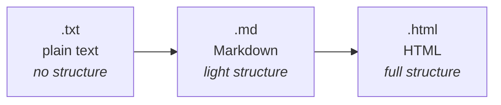

# Talk to Computers (and Your Team): Why Plain Text Wins

## Learning Objectives

By the end of this reading, you will be able to:

- **Explain** why plain-text formats are the shared language of both code and professional collaboration (MLO-1).
- **Write** basic Markdown — headers, lists, links, emphasis, and code fences — and **predict** how it renders before you look (MLO-2).
- **Place** `.txt`, `.md`, and `.html` on the markup ladder, and say what each one buys you.
- **Explain** why a Word document is the wrong tool for this job, in terms of what is actually inside the file.
- **State** why precise, ordered instructions matter *before* any code exists (MLO-4, which the Robot Sandwich will test).

## Why This Matters

M0 asked why we are here at all when an AI can write code. The honest answer was: **AI can write C++, and you still have to read it, check it, and explain it to another human.** All three of those are communication.

This module is the communication one. No C++ yet — that starts next module. What you build here is the thing every later module leans on: **saying exactly what you mean, in a format that both a machine and a teammate can read.**

That sounds soft. It is not. Nearly every tool you will touch this term — your editor, GitHub, the compiler, the AI assistant — takes plain text in and gives plain text back. A student who is fluent in plain text moves through all of it. A student who is not spends the term fighting their tools instead of the problem.

## The Core Concept

### Plain text is a format, not the absence of one

Open a `.docx` in a text editor sometime. You will not find your essay. You will find a wall of binary garbage, because a Word file is a **zip archive** full of XML, styling, fonts, and revision history. Your words are in there somewhere, wrapped in layers of machinery about how they should *look*.

A plain-text file has none of that. It is characters, in order, and nothing else. Open it anywhere, on any machine, in any decade, and you get the same thing back.

That is why every serious tool speaks it:

- **Source code** is plain text. `main.cpp` is characters.
- **Git** tracks changes line by line — which only works because lines exist.
- **The compiler** reads characters.
- **AI assistants** take text in and give text back.

> **💡 Pro Tip**: This is why the course uses **VSCode** rather than Word. VSCode is a *text* editor — what you see is what is in the file. Word is a *document* editor; it is constantly making decisions about appearance that have no meaning to a compiler. Neither is better. They are for different jobs, and only one of them is this job.

### The markup ladder

Plain text on its own has a problem: it cannot show structure. There is no way to say "this is a heading" in a `.txt` file except by convention — underlining it with `====`, say, and hoping the reader agrees.

**Markup** solves that: a few agreed-on characters that mean "this part is special." Three rungs matter here.



| Rung | What it adds | What it costs |
|---|---|---|
| `.txt` | Nothing. Characters only. | No headings, no links, no emphasis |
| `.md` | Headings, lists, links, emphasis, code blocks | A handful of symbols to learn |
| `.html` | Everything a web page can do | Tags around *every* element; verbose |

Markdown is the middle rung, and it is where most work actually lives. Here is the same heading in all three:

```text
The Dungeon Door
================
```

```markdown
# The Dungeon Door
```

```html
<h1>The Dungeon Door</h1>
```

**Markdown wins on the thing that matters most: it is readable before it is rendered.** The HTML version is unambiguous but cluttered. The Markdown version is one extra character, and a human skimming the raw file still sees a heading. That balance is the whole reason it took over.

### Predict first

Here is a small Markdown document. **Read it and write down what it will look like once rendered — how many headings, what is bold, what becomes a clickable link. Decide before you scroll.**

```markdown
# Dungeon Log

## Day 1

I found a door. It was **locked**.

Things I tried:

- the handle
- shouting
- a *very* firm push

Next time I will bring [a lockpick](https://example.com/lockpicks).
```

<details>
<summary>Reveal how it renders</summary>

- **Dungeon Log** — a big heading (one `#` = the largest)
- **Day 1** — a smaller heading beneath it (two `##` = one level down)
- The sentence, with **locked** in bold
- A bulleted list of three items, with *very* in italics
- A final sentence where **a lockpick** is a clickable link, and the URL itself does not show

The two traps people hit:

**More `#` means smaller, not bigger.** It reads backwards at first. Think of it as *depth*: one `#` is the top level, two is a sub-level.

**The blank line before the list is doing real work.** Without it, most renderers glue the list onto the previous sentence and it stops being a list at all. Markdown uses blank lines to separate blocks — they are punctuation, not whitespace.
</details>

### The syntax you actually need

This is the whole set for this course. There is more Markdown than this; you will not need it.

| You write | You get |
|---|---|
| `# Heading` | Top-level heading |
| `## Heading` | Sub-heading (add `#` to go deeper) |
| `**bold**` | **bold** |
| `*italic*` | *italic* |
| `- item` | A bulleted list item |
| `1. item` | A numbered list item |
| `` `code` `` | `code`, inline |
| `[text](url)` | A clickable link |

And the one that matters most in a programming course — the **code fence**. Three backticks, the language name, your code, three backticks:

````markdown
```cpp
cout << "Hello, world!\n";
```
````

That renders as a code block with C++ colouring. Naming the language is what turns the colours on, and it tells a reader — and an AI — what they are looking at. **Get in the habit now.** You will paste code into a README, an issue, or a chat window every week for the rest of the term, and code pasted without a fence arrives mangled.

> **⚠️ Common Pitfall**: Backticks (`` ` ``) are not apostrophes (`'`). They live in the top-left corner of most keyboards, under the `~`. Using apostrophes gets you no code block and some confused punctuation.

### Why this got more important, not less

Markdown was invented in 2004 for writing web posts. It should have stayed a niche tool. Instead it became the default way people write technical anything — READMEs, documentation, issues, notes, chat.

Then large language models arrived and made it more common still. Ask an AI assistant a technical question and the answer comes back in Markdown: headings, bullets, fenced code. That is not decoration. **It is the model using a plain-text format to mark structure, because plain text is what it reads and writes.**

Which puts you in a specific spot. When an assistant hands you a fenced block, you need to know that the fence is a fence, that the language tag is a claim about the contents, and that *you* are still the one who has to check whether the code inside is any good. M0 made the point; this is the format it arrives in.

> **🔗 Connection**: **Codespaces** — the browser-based setup this course uses — matters for the same reason. It runs the real editor and the real compiler on a machine you reach through a browser tab, so a student on a school-issued Chromebook has exactly the same environment as a student with a new laptop. That is a design requirement here, not a convenience.

### Precise instructions come before code

One more idea, and it is the one this module is graded on.

Before you can tell a *computer* what to do, you have to be able to tell a *person* what to do without them guessing. That is harder than it sounds, because humans quietly patch gaps. Say "make me a sandwich" and a person fills in a hundred unstated steps. A computer fills in none.

Your Assess beat for this module is the **Robot Sandwich**: write instructions to make a sandwich, precise enough that someone following them *exactly* — no guessing, no common sense — actually gets a sandwich. It is not a coding exercise. It has no code in it at all.

It also fails, the first time, for nearly everyone. That is the point, and it is a planned event. Watching your instructions get followed literally and produce something absurd is the fastest way to feel what a computer is actually like to work with. **M2's reading opens by looking back at exactly this** — the robot got it wrong on purpose, and that is why programming languages exist.

## Putting It Together

Three ideas, and they are the same idea:

1. **Plain text is the shared channel.** Code, git, compilers, teammates, AI — all of it moves through characters.
2. **Markdown adds just enough structure** to that channel to be useful, without making it unreadable.
3. **Precision is the actual skill.** The format only carries your meaning; it cannot supply the part you left out.

Everything after this module is C++. This is the last one where the hard part is entirely about saying what you mean.

## Common Questions

**Do I have to memorize the Markdown table?**
No. You will know the six or seven you use constantly within two weeks, from using them. GitHub's own Markdown documentation is the reference to keep open, and it is the authoritative one — different tools have small differences, and GitHub's is the flavor this course renders in.

**Why not just write everything in Word and paste it over?**
Because paste from Word brings invisible characters with it — curly quotes instead of straight ones, non-breaking spaces, odd dashes. In prose nobody notices. In code, a curly quote is a **Syntax** error your eyes cannot see, and you will lose twenty minutes to it.

**Is Markdown a programming language?**
No. It has no logic — no decisions, no repetition, no calculation. It marks up text and stops. That is a feature; a document format that could compute would be a document format that could do something unexpected.

**Can I ask an AI to write my README?**
Yes, and the answer will come back in Markdown, which is a useful thing to see. Read what it produced before you commit it. The habit to build now is small and permanent: **nothing goes into your repo that you have not read.**

## Check Yourself

**1.** You write `###Introduction` and the heading does not appear. Why?

<details><summary>Answer</summary>

**The missing space.** It needs `### Introduction`. Markdown wants a space between the `#` marks and the text — without it, the line is just literal characters. This is the single most common Markdown mistake.
</details>

**2.** Which is bigger on the page: `# Chapter` or `#### Chapter`?

<details><summary>Answer</summary>

**`# Chapter`.** More `#` means *deeper*, so smaller. One `#` is the top level.
</details>

**3.** You paste a C++ snippet into a GitHub issue with no fence around it. Name one thing that goes wrong.

<details><summary>Answer</summary>

Any of these is right: the indentation collapses, so the structure is unreadable; there is no syntax colouring; characters like `*` and `_` get eaten as emphasis markers and silently change your code; and nobody can copy it back out cleanly. Fencing it fixes all four at once.
</details>

## Next Steps

1. **Take the M1 exit ticket.** It is completion-gated — finish it to move on. Nothing on it is a trick.
2. **Bring this reading to class** for the Apply tutorial, where you will make a repo, write a real `README.md` in Markdown, commit it, push it, and see it render on GitHub. No branches — commit and push is the whole workflow for now.
3. **Then the Robot Sandwich**, which is where the precision idea gets tested for real.

> **📋 Instructor note — not yet authored.** M1 is at **First pass**: this reading
> exists; the exit ticket, the Apply tutorial, and the Robot Sandwich **do not yet
> exist** (ADR-016). Steps 1–3 describe where this beat hands off, not files you can
> open today. Do not route students here expecting the rest of the module to be
> waiting for them.
