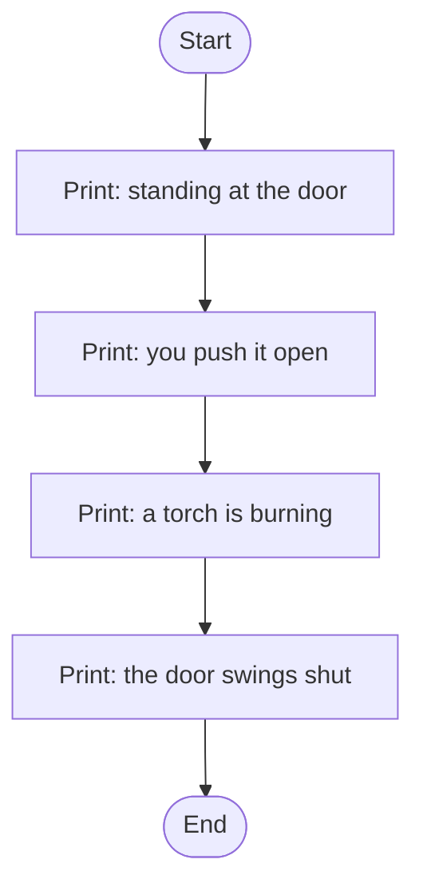
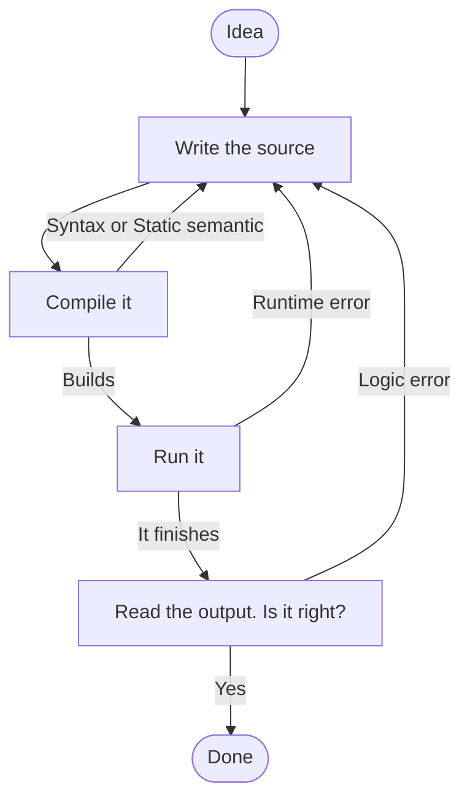

# How to Solve Problems: Why We Need Languages at All

## Learning Objectives

By the end of this reading, you will be able to:

- **Explain** why programming languages exist at all, in terms of ambiguity (MLO-M2.1).
- **Describe** what the compiler does, and point at the file it makes (MLO-M2.2).
- **Read** a straight-line program's flowchart *and its pseudocode*, and match both to the code they came from (MLO-M2.3).
- **Predict** the output of a short provided program before you run it (MLO-M2.6).
- **Classify** an error using the four course words — **Syntax**, **Static semantic**, **Runtime**, **Logic** (MLO-M2.5).

## Why This Matters

In M1 you wrote instructions for a robot making a sandwich, and the robot got them wrong on purpose. That was not a joke at your expense. It was the whole problem, in one lesson: **English is ambiguous, and machines do not guess.**

"Put the peanut butter on the bread" has at least three honest readings. A human picks the sensible one without noticing there was a choice. A machine has no sensible-one detector. So we built languages with no room to guess — and that is the only reason programming languages exist. They are not a secret code. They are English with the ambiguity removed and the punctuation made to matter.

This module is the one the rest of the course orbits. You will not write much C++ here. You will **read** it, **run** it, and learn to say precisely what went wrong when it breaks — because you cannot supervise code you cannot read. That is true of code your classmate wrote, and it is just as true of code an AI wrote for you.

## The Core Concept

### Same idea, five ways to say it

Here is the thing every language tutorial starts with, and for once the cliché is earning its keep. "Print `Hello, world!` on the screen" is a single, unambiguous idea. Watch how differently five languages say it.

HTML — a language for *describing a page*, not for giving orders:

```html
<p>Hello, world!</p>
```

JavaScript — runs inside a web browser:

```javascript
console.log("Hello, world!");
```

Python — famously tidy:

```python
print("Hello, world!")
```

C++ — ours, and noticeably more ceremonious:

```cpp excerpt=modules/m2/code/learn-hello.cpp
#include <iostream>
using namespace std;

int main()
{
    cout << "Hello, world!\n";
    return 0;
}
```

And a slice of assembly, which is close to what the machine actually chews on:

```asm
mov     edx, 13
mov     ecx, msg
mov     ebx, 1
mov     eax, 4
int     0x80
```

Same output. Five very different amounts of typing.

Notice the trade. Python said it in one line; C++ took seven. But C++ is being explicit about things Python decides for you, and assembly is being explicit about things *C++* decides for you. **Nobody removed the work — they moved it.** The higher up the list you go, the more decisions the language makes on your behalf. The further down, the more control you have and the more chances you get to be wrong.

C++ sits deliberately in the middle. That is why this course uses it: high enough to get things done, low enough that you can still see the machinery.

> **💡 Pro Tip**: `#include <iostream>` and `using namespace std;` will be at the top of nearly every program you write this term. You do not need to fully understand them today, but you should know what each one is doing. Delete the `#include` and the program stops building — nothing else tells C++ what `cout` is. Delete the `using` line and it also stops building, *unless* you go back and write `std::cout` instead of `cout` everywhere. This course keeps that line on purpose, so you are not typing `std::` on every line while you are still working out what the lines do.

### Predict first

**Read this program and write down what you think it prints. All of it, in order. Do not scroll until you have an answer.**

```cpp excerpt=modules/m2/code/learn-door.cpp
#include <iostream>
using namespace std;

int main()
{
    cout << "You are standing at the dungeon door.\n";
    cout << "You push it open.\n";
    cout << "Inside, a torch is burning.\n";
    cout << "The door swings shut behind you.\n";
    return 0;
}
```

<details>
<summary>Reveal the output</summary>

```
You are standing at the dungeon door.
You push it open.
Inside, a torch is burning.
The door swings shut behind you.
```

Four lines, in the order they were written. If you got that, good — but notice what you actually did to get it: you started at the top and walked down. That is the whole trick, and for now it is the *only* trick. Every statement runs, exactly once, top to bottom.

The `\n` at the end of each string is what moves to the next line. Take them out and all four sentences run together into one long line.
</details>

If you predicted correctly, the reason is worth naming: **this program has no decisions in it.** Nothing is skipped, nothing repeats. That changes in M4, when programs start choosing, and again in M5, when they start repeating. Predicting output gets genuinely harder then. Get the easy version solid now.

### The program, drawn

That top-to-bottom walk has a shape, and drawing it is a skill this course grades — in this module's Assess beat, and again at the capstone.



One box per statement, one arrow each, no forks. A **straight line** — because the program is one. When you meet a flowchart with a diamond in it, that diamond is a decision, and you will meet your first one in M4.

### The same program, in pseudocode

You have now seen this program twice: once as C++, once as a drawing. Here it is a third time, written as **pseudocode** — the plan in plain sentences, one step per line.

```text
START
    print "You are standing at the dungeon door."
    print "You push it open."
    print "Inside, a torch is burning."
    print "The door swings shut behind you."
END
```

Read it against the flowchart above. **One box, one line.** `START` and `END` are the two ovals. Nothing was added and nothing was lost — it is the same four steps in a third notation.

Pseudocode is not a language. No compiler reads it, and you never hand it in instead of C++. There is no official spelling, either: `print`, `display`, and `show` are all fine. The only test that matters is whether another person could follow your steps without guessing.

So why write it at all? Because you can write it **before** you know how to say it in C++. The hard part of a program is deciding what happens and in what order. Pseudocode lets you settle that first, while the syntax is still out of the way.

> **⚠️ Common Pitfall**
> Writing C++ in disguise. If your pseudocode has `cout <<`, semicolons, or `#include` in it, you skipped the thinking and went straight to typing. Steps, not statements — that is the whole point.

> **🔗 Connection**
> Remember the sandwich from M1, and how much a person filled in for you without being asked. Pseudocode is where you stop letting them. It is the same demand for exactness, made before C++ is standing in your way.

### What the compiler actually does

Python and JavaScript are usually **interpreted**: another program reads your source and does what it says, line by line, as it goes. C++ is **compiled**: a program called the compiler reads your entire source file *once*, ahead of time, and produces a second file — a real one, on disk — that the machine can run on its own.

Here is the command this course uses. You will type it a lot. Run it **from the folder your `.cpp` file is in** — in this repo that program lives in `modules/m2/code/`, so `cd` there first:

```bash
g++ -std=c++17 -Wall -Wextra -o door learn-door.cpp
./door
```

Read the first line right to left and it is almost English. Take `learn-door.cpp`, and `-o` (output) a program called `door`. The `-Wall -Wextra` flags mean *warn me about everything*, and `-std=c++17` picks which version of the language to use. The second line, `./door`, is how you actually run the thing you just built — the `./` means *the one right here in this folder*.

If the compile worked, it prints nothing at all. **Silence is success.** The compiler only speaks up when something is wrong, which takes some getting used to.

**Now the part students are surprised by.** After that command, that folder has two files, not one:

| File | What it is | Can you read it? |
|---|---|---|
| `learn-door.cpp` | The **source**. What you typed. | Yes — it's text |
| `door` | The **program**. What the compiler built. | No — it's machine code |

They sit next to each other in every file listing, with nearly the same name. Opening `door` in your editor gets you a screenful of garbage — and that is not your program being corrupted, it is you looking at a thing that was never meant for eyes. The compiler wrote it for the processor.

> **⚠️ Common Pitfall**: Only the source belongs in git. The built program is rebuilt from source in one command, on any machine, any time — so committing it just clutters your repo with a file nobody can read or review. Commit the `.cpp`. Leave the other one alone.

> **🔗 Connection**: That two-files idea is the *whole* reason the error taxonomy below has a compile-time half and a run-time half. Some mistakes stop the compiler from ever producing the second file. Others let it get built, and wait for you inside it.

### Four words for four kinds of wrong

When your program misbehaves, "it's broken" is not useful information. This course uses exactly **four words**, and you will use them all term. Learn them here.

**1. Syntax — you broke the grammar.**

```cpp excerpt=modules/m2/code/learn-break-syntax.cpp
    cout << "You are standing at the dungeon door.\n"
    cout << "You push it open.\n";
```

The semicolon after the first line is missing. The compiler says:

```
learn-break-syntax.cpp:17:54: error: expected ';' before 'cout'
   17 |     cout << "You are standing at the dungeon door.\n"
      |                                                      ^
      |                                                      ;
```

Read that carefully, because it is more helpful than it looks: it gives the line, the column, a caret pointing at the exact spot, and the character it wanted. **No program gets built.** There is nothing to run.

**2. Static semantic — grammar fine, meaning impossible.**

```cpp excerpt=modules/m2/code/learn-break-semantic.cpp
    cuot << "You are standing at the dungeon door.\n";
```

Every semicolon is present and every brace matches. It is a perfectly well-formed C++ sentence about something that does not exist — `cuot` is a typo for `cout`, and C++ has never heard of it:

```
learn-break-semantic.cpp:16:5: error: 'cuot' was not declared in this scope
   16 |     cuot << "You are standing at the dungeon door.\n";
      |     ^~~~
```

Also caught at compile time. Also no program. The difference from Syntax is *what* the compiler objected to: the grammar was fine, the meaning was not.

**3. Runtime — it ran, then fell over.**

This one builds successfully. You get a program. You run it, and partway through it dies — or hangs forever and never finishes. The compiler could not have known; nothing was wrong with the *text*.

M2 does not have a good example to show you, and that is deliberate rather than an oversight. The classic runtime failures need machinery you have not met: a loop that never ends (M5), or a user typing letters where the program expected a number (M3, then M5 in earnest). **You will meet this one properly, with real code, the moment the course can show it honestly.** For now, learn the name and the test: *did a program get built and start running?* If yes, it is not Syntax and not Static semantic.

**4. Logic — it did what you said, not what you meant.**

```cpp excerpt=modules/m2/code/learn-logic.cpp
    cout << "You are standing at the dungeon door.\n";
    cout << "The door swings shut behind you.\n";
    cout << "You push it open.\n";
```

This compiles clean. Zero warnings. It runs perfectly and finishes normally:

```
You are standing at the dungeon door.
The door swings shut behind you.
You push it open.
```

The door swings shut *before* you push it open. The machine has no opinion about this; every instruction was followed exactly. **No tool catches a Logic error.** Not the compiler, not the warnings, not the AI. Only a person who reads the program and knows what it was supposed to do.

That is why this module exists, and why its Assess beat asks you to describe a program in your own words rather than write one. Reading is the skill that catches the errors nothing else can.

## Putting It Together

The four words sort cleanly by *when* the problem shows up:

| Word | Caught by | Do you get a program? |
|---|---|---|
| **Syntax** | The compiler | No |
| **Static semantic** | The compiler | No |
| **Runtime** | Running it | Yes — it starts, then fails |
| **Logic** | A human reading it | Yes — it finishes, and lies |

Which is really one idea: **the further down the table, the later you find out, and the more it costs.** A missing semicolon costs ten seconds. A logic error can survive all the way to a grade, or to a customer.

And this is the loop you will live in all term:



Notice how many arrows point back to *write the source*. That is not a picture of failure. That is the job.

## Common Questions

**Why does C++ need `#include <iostream>` when Python just prints?**
Python ships its printing tools already loaded. C++ keeps the language small and makes you ask for what you need. It is more typing and it is also why C++ programs can run on things with no operating system at all.

**Do I have to memorize the compile command?**
You will know it by heart in about two weeks, from typing it, not from studying it. Keep it somewhere you can copy from until then.

**If the error message tells me the line number, why is debugging hard?**
Because the line the compiler names is where it *noticed*, not always where you erred — a missing semicolon gets reported on the line after it. And Runtime and Logic errors come with no line number at all.

**Can I just ask an AI to write this?**
For explaining an error message, yes — it is genuinely good at that, and this course expects you to use it. But look again at the Logic error above. It compiles clean and runs fine; there is no error message to paste. Catching it needs someone who knows what the program was *for*. That someone has to be you. AI raises the ceiling on what you can build and does nothing for the floor of what you can check.

## Check Yourself

**1.** A program compiles with zero warnings, runs, and prints a receipt total of `$0.00` when it should say `$14.50`. Which of the four words?

<details><summary>Answer</summary>

**Logic.** It built and it finished — so it is not Syntax, not Static semantic, and not Runtime. It did exactly what it was told; it was told the wrong thing.
</details>

**2.** You type `cout << "hi"` and forget the semicolon. Does the compiler produce a program?

<details><summary>Answer</summary>

**No.** That is a **Syntax** error — the grammar is broken, so compilation stops and no output file is written. Nothing exists to run.
</details>

**3.** Sketch the flowchart for a program whose whole body is three `cout` lines. How many diamonds does it have?

<details><summary>Answer</summary>

**Zero.** Start, three boxes, End, in a straight line. Diamonds are decisions, and this program never chooses anything. Your first diamond arrives in M4.
</details>

**4.** A classmate hands you this as pseudocode. Name what is wrong with it.

```text
START
    cout << "Hello";
END
```

<details><summary>Answer</summary>

**It is C++ in disguise.** The `cout <<` and the semicolon are C++ syntax, not steps — so it skipped the thinking it exists to do. The step is `print "Hello"`. Pseudocode describes *what happens*; the language comes after.
</details>

## Next Steps

1. **Take the M2 exit ticket.** It is completion-gated — finish it to move on. Nothing on it is a trick.
2. **Bring this reading to class** for the Apply tutorial, where you will type a program in, compile it, and then break it on purpose to watch the compiler complain. Naming what you broke, in the four words, is the point of the exercise.
3. **Optional:** the `thinkcpp` predict-the-output checkpoints are more reps at the skill from the *Predict first* section above. The skill is worth the reps.

> **📋 Instructor note — not yet authored.** M2 is at **First pass**: this reading
> exists; the exit ticket and the Apply tutorial **do not yet exist** (ADR-016).
> Steps 1 and 2 describe where this beat hands off, not files you can open today. Do
> not route students here expecting the rest of the module to be waiting for them.
