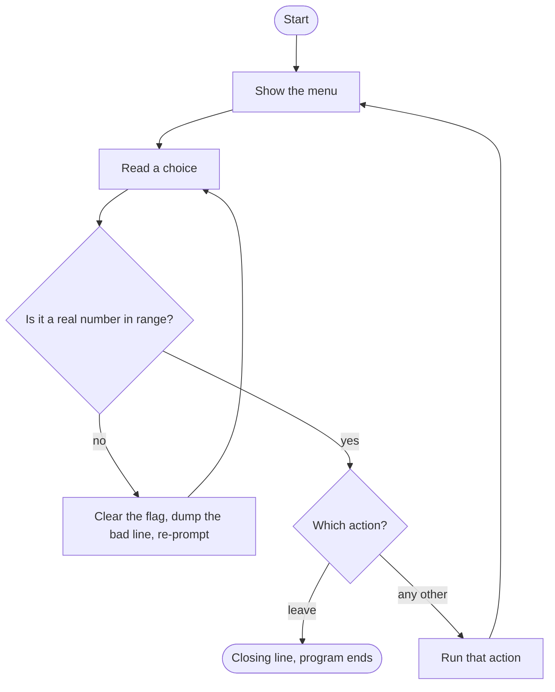

# M5LAB: Loop Fundamentals + Project 2 — The Menu-Driven Game

## The Mission

Two parts, and they are different on purpose.

**Part 1 — Loop Fundamentals.** Three short exercises: one `while`, one `for`,
one search through a bag of runes. These are the reps. They prove you can pick
the right loop for the job and get its bounds right.

**Part 2 — Project 2: the menu-driven game.** The real thing. You take a tavern
that already has a working menu and turn it into a program that survives a
player who types nonsense at it. This is the program M6 will refactor and M7
will extend, so build something you will not mind seeing again.

You start Part 2 from a working file, the same way the Apply tutorial ended. You
will not start from a blank page.

## Specification

*(This section is the contract. Strip every dungeon word out of it and the
requirements still make sense — that is the test of a good spec, and in M8 you
write these yourself.)*

### Part 1 — Loop Fundamentals (`m5lab-warmup.cpp`)

| | Exercise 1 | Exercise 2 | Exercise 3 |
|---|---|---|---|
| **Loop type** | `while` | `for` | `for` + a decision |
| **Input** | none (values are given) | none | none |
| **Processing** | Add 7 to `health` per pass, count passes, until `health` reaches 100 or more | For each day 1 through 12, compute `20 + day * 4` | Walk all 8 slots of `runes`; find whether `target` is present and at which index |
| **Output** | One line per pass, then a summary line | A header plus twelve aligned rows | A "found in slot N" or "not in the bag" line |

The count in Exercise 1 is **not known in advance** — that is why it is a
`while`. The count in Exercise 2 **is** known — that is why it is a `for`.
Choosing correctly is part of the grade.

### Part 2 — Project 2: the menu-driven game (`m5lab-game.cpp`)

**Inputs.** A menu choice, typed by the player, once per turn. At higher tiers,
one or more additional numbers typed inside an action.

**Processing.** A `do`/`while` loop shows a menu, reads a choice, runs the
matching action, and comes back — until the player chooses the "leave" option.
Every number the program reads from the player must be validated: both for
**type** (letters must not break it) and for **range** (numbers outside the menu
must be rejected).

**Outputs.** The menu, the result of each action, and a closing line after the
loop ends.

**The one hard rule:** *the player must always be able to reach the exit.* No
input, however hostile, may trap the program in a loop it cannot leave.

## Requirements by Tier

Tiers **nest**: B includes all of C, A includes all of B. You may stop at C with
a complete, passing submission — C is "the objective, met," not partial credit.

### C Tier — The Doors Open

**Part 1:** all three exercises produce correct output. Exercise 2 prints all
twelve days (mind the fence-post).

**Part 2:** replace the unguarded menu read with a **validation loop**. It must
re-prompt, without ever spinning, when the player types:

- letters (`banana`)
- a number that is too large (`9`)
- a number that is too small (`0`)

and it must accept `1`, `2`, and `3` normally, and exit cleanly on `3`.

This is the exact piece you wrote in the Apply tutorial, applied to your own
scene. Everything else in the starter already works.

### B Tier — A Second Voice (everything in C, plus…)

Add a **second validated numeric read** inside one of the menu actions — the
barkeep asks you for a number (gold slid across the bar, say). It gets the same
bulletproofing the menu read got: bad type re-prompts, bad range re-prompts.

Writing the pattern twice is the point. The first time you were copying a shape;
the second time you are choosing it.

### A Tier — The Seam (everything in B, plus…)

Three additions, all of which make the loop *do something a single pass could
not*:

1. **Wrap an M4-style decision around that number.** The barkeep replies
   differently depending on what you offered — a generous amount, a fair amount,
   an insult. This is an `if` / `else if` / `else` chain living **inside** the
   loop.
2. **Give one bad answer a second chance with `continue`.** If the player offers
   more gold than they have, say so and `continue` back to the menu. In M4 a bad
   answer ended the program. Here the loop hands them another turn. *That is the
   seam this whole module is about.*
3. **Add a fourth menu option that searches a sequence** — reuse the search you
   wrote in Part 1, Exercise 3, as a real feature (rummaging a satchel, checking
   a bounty list). Remember to widen your validation range from 1-3 to 1-4.

Carry at least one value — gold, reputation, hit points — **across** menu turns,
so the loop has memory. Declare it before the `do`, not inside it.

### Badge — Show Your Work

Never a substitute for C/B/A; it rides on top. Submit **both**:

1. **A hand-completed trace table** for one non-trivial loop in your submission.
   Photograph a paper one or type it as a Markdown table. Show at least four
   passes, including the pass where the loop **stops**.
2. **`prompts.md`** — every AI prompt you used and what you changed about the
   answers. If you used no AI, write one honest sentence saying so, plus a short
   reflection: *where did you use `for` versus `while`, and why?*

## Sample Runs

### Part 1 — the finished warm-up

```
==== EXERCISE 1: THE LONG REST ====
Health starts at 58.
Hour 1: health is 65
Hour 2: health is 72
Hour 3: health is 79
Hour 4: health is 86
Hour 5: health is 93
Hour 6: health is 100
Rested 6 hours. Final health: 100.

==== EXERCISE 2: TWELVE DAYS OF PAY ====
  DAY    GOLD
    1      24
    2      28
    3      32
    4      36
    5      40
    6      44
    7      48
    8      52
    9      56
   10      60
   11      64
   12      68

==== EXERCISE 3: SEARCH THE RUNE BAG ====
The bag holds: 3 14 7 22 9 41 16 5
Looking for rune 22.
Found rune 22 in slot 3.
```

Note Exercise 1 ends at **100, not 99 or 107** — the loop stops the first time
health reaches 100, and the check happens *before* each pass. Note Exercise 3
reports **slot 3**, not slot 4: the first slot is slot 0.

### Part 2 — C tier, with a hostile player

```
You duck into the Adventurer's Rest. The room is warm.

==== THE ADVENTURER'S REST ====
1) Read the bounty board
2) Talk to the barkeep
3) Leave
Choose (1-3): That is not on the menu. Choose 1, 2, or 3: That is not on the menu. Choose 1, 2, or 3:
The barkeep nods. "Nothing for you yet."

==== THE ADVENTURER'S REST ====
1) Read the bounty board
2) Talk to the barkeep
3) Leave
Choose (1-3):
You step back into the night.

The door swings shut behind you.
```

*(Player typed `banana`, then `9`, then `2`, then `3`.)* Your re-prompt wording
is your own — it just has to be clear.

## Design First

Before you write Part 2's validation, draw what you are building. Your program
must match this shape:



Two things worth noticing in that picture, because they are where marks are
won and lost:

- **The re-prompt arrow goes back to "Read a choice," not to "Show the menu."**
  A player who fumbles a keystroke should not get the whole menu shouted at them
  again.
- **Only one arrow leaves the diagram**, and it is the "leave" branch. If you can
  draw a second way out, or no way out, your loop is wrong.

## Getting Started

Pull the starters and make your working copies. **Do not edit the starter files
directly** — copy them first, so you can always get back to a clean original.

```bash
git pull
cp modules/m5/code/assess-warmup-starter.cpp m5lab-warmup.cpp
cp modules/m5/code/assess-game-starter.cpp  m5lab-game.cpp
```

Both starters **compile clean and run as-is**. Build them before you change
anything, so you know your toolchain is fine and any later break is yours:

```bash
g++ -std=c++17 -Wall -Wextra -o m5lab-warmup m5lab-warmup.cpp
./m5lab-warmup

g++ -std=c++17 -Wall -Wextra -o m5lab-game m5lab-game.cpp
./m5lab-game
```

The warm-up starter runs but gives **visibly wrong answers** — zero hours
rested, an empty table, a rune it cannot find. Those wrong answers are your to-do
list. The game starter runs correctly until someone types a letter at it.

**The bar: zero warnings.** Not "it compiled." Warnings fail the Format column
even when the program works.

**Everything lives in `main`.** No functions, no prototypes — those arrive in M6.
Your `main` will get long. That is expected, and it is exactly the pain M6 fixes.

## Testing Your Work

Verification is graded behavior in this course, not an afterthought. Run every
one of these.

### Part 1

| Try this | Expected |
|---|---|
| Run it as given | Exercise 1 says "Rested 0 hours" — that is the bug you fix |
| Count Exercise 2's rows | Exactly **12**. Eleven or thirteen means a fence-post slip |
| Change `target` to `41` | `Found rune 41 in slot 5` |
| Change `target` to `99` | `No rune 99 in the bag.` — the not-found path must work too |

That last one matters. A search that only ever reports "found" is not a search;
it is a program that has never been told no.

### Part 2

| Type this | Expected |
|---|---|
| `banana` | Re-prompts. Does **not** spin |
| `9` | Re-prompts — in range matters, not just numeric |
| `0` | Re-prompts — guard the low end too |
| `3` (or your exit number) | Exits cleanly |
| `banana` **then** `2` | Recovers and runs action 2 — recovery must actually recover |
| B tier: `banana` at the barkeep's number | Re-prompts there too |

**Before you run Part 1's Exercise 1, trace it.** Fill this in by hand, then
check yourself against the machine:

| Pass | `health` before the check | `health < 100`? | `health` after | `hoursRested` |
|---|---|---|---|---|
| 1 | 58 |  |  |  |
| 2 |  |  |  |  |
| 3 |  |  |  |  |

If your hand and the machine disagree, the trace table tells you *which pass*
went wrong. (Keep this table — a completed one is half the Badge.)

## Troubleshooting

Organized by the four error names, because naming the class is most of the fix.

### It won't compile (Syntax / Static semantic)

**`expected ';' before ...`** — Syntax. Check the line *above* the one reported;
a missing semicolon is usually noticed one line late. If it points near a
`do`/`while`, remember a `do-while` ends with a semicolon after `while (...)`.

**`use of undeclared identifier 'setw'`** — Static semantic. You need
`#include <iomanip>`.

**`use of undeclared identifier 'numeric_limits'`** — Static semantic. You need
`#include <limits>`. It is already in both starters; check you did not delete it.

**`expected expression` around your `for` header** — Syntax. The three parts of a
`for` are separated by semicolons, not commas.

### It compiles but hangs or spins (Runtime)

**The menu repeats forever and ignores you.** This is the `cin` fail state. You
either did not call `cin.clear()`, or you did not call
`cin.ignore(numeric_limits<streamsize>::max(), '\n')`, or you called them in the
wrong order. You need **both**, in that order: clear the flag, then dump the
line. `Ctrl+C` stops it.

**Exercise 1 never finishes.** Your `while` body does not change `health`, so the
condition can never become false. Every loop needs an update that moves it toward
the exit.

### It runs but the answer is wrong (Logic)

**Eleven rows instead of twelve** (or nine instead of ten). The off-by-one. You
wrote `<` where you meant `<=`, or started at 0 where you meant 1. Nothing will
warn you about this — only counting will catch it.

**Your validation accepts everything.** Almost always this:

```cpp
while (!(cin >> choice) && choice < 1 && choice > 3)   // WRONG — silently does nothing
```

A number cannot be both below 1 and above 3, so the condition is never true and
the loop never runs. It compiles clean and looks reasonable, which is what makes
it dangerous. The input is bad if the read fails **or** it is too small **or** it
is too big — any one is enough. Use `||`.

**The search says "not found" for a rune that is right there.** Check your bounds
(`i < 8`, not `i < 7`) and check you used `==` and not `=`.

## Submission

1. Pull first: `git pull`
2. Confirm a clean build for **both** files — zero warnings:
   ```bash
   g++ -std=c++17 -Wall -Wextra -o m5lab-warmup m5lab-warmup.cpp
   g++ -std=c++17 -Wall -Wextra -o m5lab-game   m5lab-game.cpp
   ```
3. Commit: `git add m5lab-warmup.cpp m5lab-game.cpp`
   then `git commit -m "M5 Lab: [what works — name your tier]"`
4. Push: `git push`
5. **Check on github.com that your files are there.** If you cannot see them,
   neither can your instructor.

Going for the Badge? Also commit `prompts.md` and your trace table (a photo is
fine — `git add` it like any other file).

You commit and push straight to your repository. **No branches, no pull
requests** — those are an M8 topic.

---

## Rubric

*Inherits `_contracts/rubric-template.md`. Four columns, four tiers, nothing
hidden.*

### The tier ladder

| Tier | Fixed meaning (course-wide) | What this lab asks for |
|---|---|---|
| **C — core** | The core competency, demonstrated end to end; a complete, passing submission. | Part 1's three exercises correct; Part 2's menu read fully validated for **type and range**, re-prompting without spinning, exiting cleanly. |
| **B — depth** | One added concept from the module, or a harder case of the first. | A **second** validated numeric read inside a menu action, bulletproofed the same way. |
| **A — synthesis** | Concepts combined, or the taught case pushed further. | An M4-style decision wrapped **inside** the loop; one bad answer routed back with `continue`; a fourth menu action that searches a sequence; at least one value carried across menu turns. |
| **Badge — above & beyond** | Documentation/reflection beyond the code. | A hand-completed trace table (4+ passes, including the stopping pass) **and** `prompts.md` with a short `for`-vs-`while` reflection. |

### The four-column scoring table

| Criterion | Points | What we're looking for |
|---|---|---|
| **Correctness** | 8 | Loops run the right number of times — no off-by-one. Validation actually rejects bad input rather than appearing to. The search reports both found and not-found correctly. The program always reaches its exit. |
| **Completeness** | 6 | Everything the **attempted tier** requires is present, including the named edge cases: letters at every prompt, out-of-range numbers at both ends, and a not-found search result. |
| **Format** | 3 | Readable code, helpful comments, aligned table output. **Compiles clean under `g++ -std=c++17 -Wall -Wextra` — zero warnings.** |
| **Submission** | 3 | Both `.cpp` files named correctly, in the right repo, committed and pushed (no branches — commit straight to your repository). `prompts.md` present if AI was used. |
| **Total** | **20** | |

**No hidden criteria — what is on this page is the whole rubric.**

---

## Reskinning this lab

The tavern is a costume. If the dungeon theme is not for you, change the nouns
and the printed text — a coffee shop with an order menu, an ATM, a help desk, a
character creator. Keep the **structure**: a menu loop, a validated read, an
action that decides, a way out.

If your reskin makes any requirement above stop making sense, that is a bug in
the lab, not in your idea. Tell your instructor.

---

## Instructor notes (not part of the student handout)

- **Reference solutions:** `modules/m5/code/assess-warmup-reference.cpp` (Part 1,
  all three exercises) and `modules/m5/code/assess-reference.cpp` (Part 2, A-tier
  exemplar). The Part 2 reference is deliberately a **different skin** — a
  wandering merchant, not the tavern students start from — so grading against it
  requires reading structure rather than diffing text. It also demonstrates that
  the theme strips cleanly, which is a course-wide claim we should keep proving.
- **The `&&`-for-`||` substitution is the highest-yield thing to look for.** It
  compiles clean, reads plausibly, and silently disables all validation. It
  cannot be caught by reading quickly — run test case 1 (`banana`) on every
  submission before anything else.
- **Do not require array-search in Part 2 below A tier.** It is exercised in
  Part 1 by every student at every tier; folding it into the game is the
  synthesis ask, and the starter has no scaffold for it.
- **Scope guard:** everything here is `while` / `do-while` / `for`, the `cin`
  fail-state idiom, and one fixed-size array walked by index. No functions (M6),
  no structs or array manipulation beyond iteration (M7), no file I/O (descoped,
  ADR-011). A submission that uses functions is not wrong-as-code, but it is
  ahead of the course; note it and move on rather than penalizing it.
- **Timing check:** C tier is genuinely ~90 minutes for a median student because
  Part 1 is three separate small programs. If the cohort runs long, Part 1
  Exercise 2 is the safest cut — it is the closest repeat of the Apply tutorial's
  type-in.
