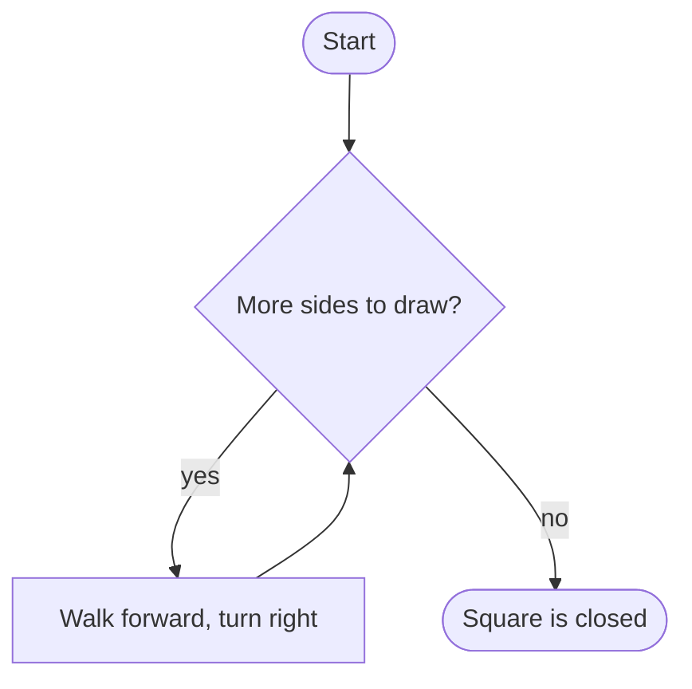
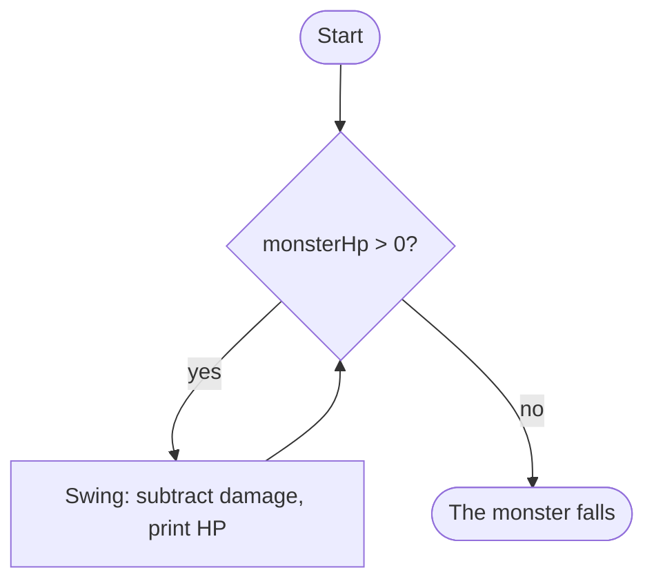
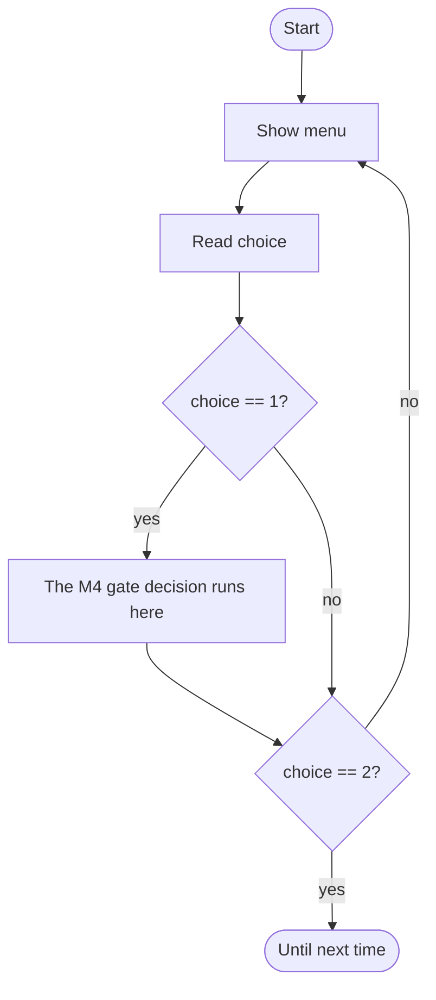

# Loops: Teaching Your Program to Repeat

## Learning Objectives

By the end of this reading, you will be able to:

- **Implement** iteration three ways — `while`, `do-while`, and `for` — and pick the right one for the job (MLO 5.1).
- **Predict** a loop's output using a **trace table** before you run the program (MLO 5.3).
- **Explain** why an input needs a loop-and-validate wrapper, and why the `cin` fail-state takes *two* calls to recover from (MLO 5.2).
- **Name** the two classic loop traps — the **infinite loop** (Runtime) and the **off-by-one** (Logic) — before they bite you (MLO 5.2, 5.3).
- **Read** the M4→M5 seam: how a menu loop *wraps* a decision you already know, instead of replacing it (MLO 5.4).

## Why This Matters

Every M4 program you wrote made one decision and stopped. The gatekeeper sized you up, opened or shut the gate — and the program ended. One pass, top to bottom, done. Useful, but the program only ever got *one* turn.

M5 changes that. A loop is how you tell a program: **do this again.** The gatekeeper's door becomes a menu the player keeps coming back to. "Ask again if that input was garbage" turns from a lucky accident into a pattern you can *count on*. And the big shift underneath: loops don't throw away decisions — they **wrap** them. The exact `if` / `else if` / `else` you built in M4 drops right into a loop as one repeated action. You'll see that seam up close in this reading.

This is also where **verification gets real.** Up to now you could eyeball a short program and guess its output. Loops run the same lines many times, and "many times" is where guesses go wrong. So M5 gives you a tool: the **trace table**, where you walk the loop by hand, one row per pass, and *know* the output before the machine tells you.

> **🔗 Connection**: Our running scene is the **dungeon door**. In M4 a gatekeeper judged you once. In M5 the door grows a menu — approach the gate, hear the rules, or leave — and you return to it until *you* decide to go. The skin peels off clean: a coffee-shop order screen, a bank ATM, a game's main menu. The *loop* stays exactly the same.

## The Core Concept

### See it first: the turtle's square

Before any loop syntax, look at a loop. Picture a turtle drawing a square. It does the same two moves — go forward, turn right — four times:

```python
# This is the picture, not your homework. Watch the turtle repeat.
import turtle
t = turtle.Turtle()
for side in range(4):      # the COUNT: four reps
    t.forward(100)         # the BODY: what repeats
    t.right(90)            # the BODY
```

Name the two parts and they pay off in every loop, in every language you ever touch:

- **The body** — the lines that repeat. Here: forward, then turn.
- **The count** — how many times. Here: four sides.

That's the whole idea of a loop: *a body that repeats, and a count of how many times.* A square is four identical moves. Here's the same shape as a diagram — one path that loops back on itself until the count runs out:



Now let's build that idea in C++, three different ways.

### The `while` loop: keep going *until*

A `while` loop checks its condition **before** every pass. "While this is true, do the body again." The moment the condition is false, the loop stops and the program moves on.

**Predict first.** Read this complete program. The monster starts at 30 HP and you hit for 10. What prints? Write your guess down before you scroll.

```cpp source=modules/m5/code/learn-combat-while.cpp
// learn-combat-while.cpp — CSC-134 M5 (Loops) Learn beat
// ...
#include <iostream>
using namespace std;

int main()
{
    int monsterHp = 30;      // the monster starts at 30 HP
    int damage = 10;         // each hit takes 10 off

    while (monsterHp > 0)    // the condition: checked BEFORE every swing
    {
        cout << "You swing! The monster takes " << damage << " damage.\n";
        monsterHp = monsterHp - damage;   // the update: move toward the exit
        cout << "Monster HP is now " << monsterHp << ".\n";
    }

    cout << "The monster falls. Well fought.\n";
    return 0;
}
```

<details>
<summary>Reveal the output</summary>

```
You swing! The monster takes 10 damage.
Monster HP is now 20.
You swing! The monster takes 10 damage.
Monster HP is now 10.
You swing! The monster takes 10 damage.
Monster HP is now 0.
The monster falls. Well fought.
```

Three swings. After the third, `monsterHp` is `0`, so `0 > 0` is false and the loop stops. Notice the last line is *outside* the loop — it runs once, after. If you guessed a fourth swing, you were checking the condition at the wrong moment; `while` checks *before* the body, not after.
</details>

Here's that loop as a flowchart. Same shape as the turtle: a condition, a body, and an arrow back up:



> **⚠️ Common Pitfall**: See that line `monsterHp = monsterHp - damage;`? That's the **update** — the step that moves the loop toward its exit. Delete it and `monsterHp` stays 30 forever, `30 > 0` is always true, and the loop never stops. That's an **infinite loop**: the program *ran*, then got stuck and never reached the end — a **Runtime** failure. If it ever happens to you, `Ctrl+C` is your emergency stop. Every loop needs a body that changes something the condition looks at.

### The `do-while` loop: act first, check later — and the M4 seam

A `do-while` flips the order: it runs the body **once**, *then* checks whether to go again. That "always at least once" is exactly what a menu wants — you have to *show* the menu before anyone can pick from it.

And here's the moment M5 has been building toward. Watch the M4 gatekeeper decision drop straight into a loop as **one menu action**:

```cpp source=modules/m5/code/learn-menu-dowhile.cpp
// learn-menu-dowhile.cpp — CSC-134 M5 (Loops) Learn beat
// ...
#include <iostream>
using namespace std;

int main()
{
    int choice = 0;

    do
    {
        cout << "\n==== THE DUNGEON DOOR ====\n";
        cout << "1) Approach the gate\n";
        cout << "2) Leave\n";
        cout << "Choose (1-2): ";
        cin >> choice;

        if (choice == 1)
        {
            // ===== the M4 decision core, as one menu action =====
            int strength = 0;
            cout << "Your strength (0-100): ";
            cin >> strength;

            if (strength >= 70)
            {
                cout << "The gate swings wide. Go through.\n";
            }
            else
            {
                cout << "Turned away. Try again from the menu.\n";
            }
        }

    } while (choice != 2);

    cout << "Until next time, traveler.\n";
    return 0;
}
```

**Program Output** (input: `1`, then `80`, then `2`):

```
==== THE DUNGEON DOOR ====
1) Approach the gate
2) Leave
Choose (1-2): Your strength (0-100): The gate swings wide. Go through.

==== THE DUNGEON DOOR ====
1) Approach the gate
2) Leave
Choose (1-2): Until next time, traveler.
```

Look at what the loop did — and didn't do. The `if (strength >= 70)` decision is the *same* decision from M4. The loop didn't replace it; it **wrapped** it. In M4, an unwelcome answer meant `return 0;` and the program ended. In M5, "Turned away. Try again from the menu." — because the loop hands the player another turn. That's the seam. Here it is as a picture: the menu is the loop; the M4 decision is one box *inside* it.



> **💡 Pro Tip**: A `do-while` ends with a **semicolon** after the `while (...)`. A plain `while` loop does *not*. Forgetting it — or adding a stray `;` after a `while` header — is a quick **Syntax** slip the compiler will catch. Read its complaint; it usually points right at the line.

One honest gap: this menu *trusts* you to type a number. Type a letter and it misbehaves — which is exactly the problem the next section solves on purpose.

### The `for` loop: the turtle's count, made real

When you know the count up front — "do this exactly N times" — the `for` loop puts all three moving parts on one line: where to **start**, how long to **keep going**, and how to **advance**. Remember the turtle's four sides? That's a count. Here it is in C++:

```cpp source=modules/m5/code/learn-square.cpp
// learn-square.cpp — CSC-134 M5 (Loops) Learn beat
// ...
#include <iostream>
using namespace std;

int main()
{
    // start at side 1, keep going while side <= 4, add 1 each time
    for (int side = 1; side <= 4; side++)
    {
        cout << "Side " << side << ": walk forward, then turn right.\n";
    }

    cout << "Back where you started. The square is closed.\n";
    return 0;
}
```

**Program Output:**

```
Side 1: walk forward, then turn right.
Side 2: walk forward, then turn right.
Side 3: walk forward, then turn right.
Side 4: walk forward, then turn right.
Back where you started. The square is closed.
```

The header `for (int side = 1; side <= 4; side++)` reads as three parts split by semicolons: **start** `side = 1`, **keep-going test** `side <= 4`, **advance** `side++` (which just means "add 1 to `side`"). A `while` loop makes you scatter those three parts around; a `for` gathers them in one place.

Now the real one — the **Level Up Stats** table you'll type in class. Each level, three stats grow at different rates, and the table prints neatly with `setw(n)` (from `<iomanip>`), which sets a column to `n` characters wide:

```cpp source=modules/m5/code/learn-levelup-for.cpp
// learn-levelup-for.cpp — CSC-134 M5 (Loops) Learn beat
// ...
#include <iostream>
#include <iomanip>
using namespace std;

int main()
{
    cout << setw(5) << "LVL" << setw(6) << "STR"
         << setw(6) << "DEX" << setw(6) << "INT" << "\n";

    for (int level = 1; level <= 10; level++)
    {
        int strength     = 10 + level * 2;   // grows by 2 each level
        int dexterity    =  8 + level * 3;   // grows by 3 each level
        int intelligence = 12 + level * 1;   // grows by 1 each level

        cout << setw(5) << level << setw(6) << strength
             << setw(6) << dexterity << setw(6) << intelligence << "\n";
    }

    return 0;
}
```

### Verification gets real: the trace table

Don't run it yet. **Trace it.** A trace table walks the loop by hand — one row per pass — so you know the output before the machine does. Fill in each stat using the formulas: STR = `10 + level*2`, DEX = `8 + level*3`, INT = `12 + level*1`. Here are the first three passes:

| Pass | `level` | `level <= 10`? | STR = 10+2·lvl | DEX = 8+3·lvl | INT = 12+1·lvl | Row printed |
|---|---|---|---|---|---|---|
| 1 | 1 | true | 12 | 11 | 13 | `1  12  11  13` |
| 2 | 2 | true | 14 | 14 | 14 | `2  14  14  14` |
| 3 | 3 | true | 16 | 17 | 15 | `3  16  17  15` |

The loop keeps going until `level` reaches 11, when `11 <= 10` is false and it stops. That's **10 rows**, levels 1 through 10. Now check yourself against the real run:

**Program Output:**

```
  LVL   STR   DEX   INT
    1    12    11    13
    2    14    14    14
    3    16    17    15
    4    18    20    16
    5    20    23    17
    6    22    26    18
    7    24    29    19
    8    26    32    20
    9    28    35    21
   10    30    38    22
```

Your three traced rows match the top three. That's the muscle M5 is building: predict, then run, then compare. When they disagree, the trace table shows you *which pass* went wrong.

> **⚠️ Common Pitfall**: The **off-by-one** is the loop world's most famous bug. Write `level < 10` when you meant `<= 10` and the table prints **9 rows** instead of 10 — no crash, no warning, just a quietly wrong answer. That's a **Logic** error: the program did what you *said*, not what you *meant*. The fence-post question — "does the last value count, or not?" — is worth a two-second pause every single time you write a loop.

### One thing a counted loop is for: walking a list

A counted loop is how you visit a whole *list* of values one at a time, and that
shows up on the exit ticket and again in the lab, so here is the shape.

A list of numbers with one name is written like this:

`int potions[5] = {2, 5, 8, 11, 14};`

That makes **five numbered slots** under one name. You read a slot by putting its
number in square brackets — `potions[0]` is `2`, `potions[1]` is `5`, and so on.

**The slots count from 0, not from 1.** Five slots are numbered `0, 1, 2, 3, 4`
— so the last one is `potions[4]`, not `potions[5]`. That is the fence-post
question again wearing a different hat, and it is why a loop over a list is
almost always written `for (int i = 0; i < 5; i++)`: start at `0`, stop
*before* `5`. Inside such a loop, `potions[i]` is "the value in slot `i`."

You will meet lists properly in M7, where they get their real name and a lot
more to do. For now this is all you need: **a counted loop can walk one, and the
first slot is slot 0.**

### Loop-and-validate: bulletproofing input

Back to that honest gap in the menu. What happens when `cin >> choice` expects a number and the player types `hello`? `cin` can't turn letters into an `int`, so it gives up and enters a **fail state** — a broken mode where it stops reading anything. If a loop keeps calling a broken `cin`, it spins forever printing nothing. That's an **infinite loop** again — a **Runtime** failure — this time caused by an unguarded `cin` fail-state.

The fix is a pattern worth memorizing *by understanding*, not by copy-paste. This is the exact validation loop from the course's frozen menu program — the piece you'll finish in the Apply tutorial:

```cpp source=modules/m5/code/learn-validate.cpp
// learn-validate.cpp — CSC-134 M5 (Loops) Learn beat
// ...
#include <iostream>
#include <limits>
using namespace std;

int main()
{
    int choice = 0;
    cout << "Choose a door (1-3): ";

    // Keep asking while EITHER the read fails OR the number is out of range.
    while (!(cin >> choice) || choice < 1 || choice > 3)
    {
        cin.clear();  // step 1: turn OFF the fail flag so cin can read again
        cin.ignore(numeric_limits<streamsize>::max(), '\n');  // step 2: dump the bad line
        cout << "That is not a door. Choose 1, 2, or 3: ";
    }

    cout << "You chose door " << choice << ".\n";
    return 0;
}
```

**Program Output** (input: `5`, then `x`, then `2`):

```
Choose a door (1-3): That is not a door. Choose 1, 2, or 3: That is not a door. Choose 1, 2, or 3: You chose door 2.
```

The `5` is a number but out of range, so `choice > 3` is true and we re-ask. The `x` makes the read *fail*, so `!(cin >> choice)` is true and we re-ask. Finally `2` passes both checks and the loop lets go.

The heart of it is those two recovery lines, and **you need both**:

- `cin.clear();` turns **off** the fail flag. Until you do this, `cin` stays broken and refuses to read anything — leave it out and you get the infinite loop.
- `cin.ignore(numeric_limits<streamsize>::max(), '\n');` throws away the **bad characters still sitting in the buffer**. The `x` you typed is still in line, waiting. Leave this out and the very next read grabs that same `x`, fails again — also an infinite loop.

One call fixes the flag; the other clears the mess. Skip either and the loop spins. That's *why* the pattern is two lines, not one.

## Putting It Together

You now have the whole M5 toolkit:

- **`while`** — checks *before* the body; use it when you don't know the count ("until the monster drops").
- **`do-while`** — runs *once*, then checks; the natural shape for a menu that must show itself first.
- **`for`** — start, test, advance on one line; use it when you *know* the count ("levels 1 to 10").
- The **loop-and-validate** pattern that makes any `cin` read bulletproof.

And two traps, named out loud: the **infinite loop** (Runtime — the update is missing, or `cin` is stuck) and the **off-by-one** (Logic — the fence-post is wrong). Neither is a gotcha. You met them here on purpose so you recognize them in lab instead of losing an afternoon.

Most of all: the loop **wraps** the decision. The M4 gatekeeper didn't disappear in M5 — it became one action the player can return to. That's the shape every menu-driven program in this course is built on.

## Common Questions

**"When do I use `while` versus `for`?"**
Use `for` when you know the count ("10 levels," "4 sides"). Use `while` when you're waiting on a condition and don't know how many passes it'll take ("until HP hits 0," "until the input is valid"). A `do-while` is a `while` for the special case where the body must run at least once — menus, mostly.

**"But what if the user types a word instead of a number?"**
`cin` enters its fail state and stops reading — that's the **Runtime** failure the loop-and-validate pattern is built to survive. `cin.clear()` un-breaks the stream and `cin.ignore(...)` dumps the bad input, so the loop can ask again cleanly. You saw it above; you'll finish it yourself in Apply.

**"Why does the `do-while` need a semicolon but a `for` doesn't?"**
Because a `do-while` ends with a `while (...)` *statement*, and statements end in `;`. A `for` or plain `while` ends with a `{ }` block, which doesn't take a semicolon. Miss it and the compiler flags a **Syntax** error — grammar broken — and points at the line.

**"Do I have to memorize the `cin.clear()` / `cin.ignore()` lines?"**
The *shapes* will stick from use. What matters is knowing *why both* are there — one resets the flag, one clears the buffer — because that's what lets you fix it when it breaks. A pattern you understand is one you can debug; a pattern you copied is one you're stuck with.

**"Can I just ask AI to write the loop?"**
For *explaining* a loop you're stuck on, sure — that's a fair use of the AI ladder. But Assess will ask *you* to trace a loop by hand and predict its output. You can't supervise code you can't read, and a trace table is exactly the reading skill AI can't do for you. If you use AI, record it in `prompts.md`.

## Check Yourself

**1. Predict the output.** How many times does the body run?

```cpp excerpt=modules/m5/code/learn-check-rooms.cpp
    for (int i = 0; i < 4; i++)
    {
        cout << "Room " << i << "\n";
    }
```

<details>
<summary>Answer</summary>

Four times — `Room 0`, `Room 1`, `Room 2`, `Room 3`. This one starts at `0` and stops *before* `4` (`i < 4`), so it counts 0, 1, 2, 3. Same count as `1` to `4`, just a different starting line. The start value is a choice, not a rule.
</details>

**2. Classify the error.** A student writes a `while (hp > 0)` loop but forgets the line that lowers `hp`. The program prints the same line forever until they hit `Ctrl+C`. Which of the four error types is this — Syntax, Static semantic, Runtime, or Logic?

<details>
<summary>Answer</summary>

**Runtime.** It compiled fine (grammar OK) and it *ran* — then got stuck and never reached the end. A loop whose condition can never become false is the textbook **infinite loop**, a Runtime failure.
</details>

**3. Trace it.** Using the Level Up Stats formulas (STR = `10 + level*2`), what STR prints on the row for `level` 6?

<details>
<summary>Answer</summary>

`22`. STR = 10 + 6·2 = 10 + 12 = 22. Check it against the output table above — row 6 reads `22`. That's the trace table working: you got the answer without running anything.
</details>

## Next Steps

1. **Take the M5 exit ticket** (Practice). It's short, low-stakes, and completion-gated — a few predict-the-output and spot-the-off-by-one items, just like Check Yourself above. It confirms you can read a loop before you write one.
2. **Bring this reading to class for the Apply tutorial.** You'll type in the **Level Up Stats** `for` loop yourself and get the table aligned — then the menu system arrives about 80% built, and you finish the validation loop you just met here.
3. **Optional deeper dive:** the `thinkcpp` chapter on iteration, and the `cppreference` pages on `while` and `for`, if you want a second voice on the same ideas.
