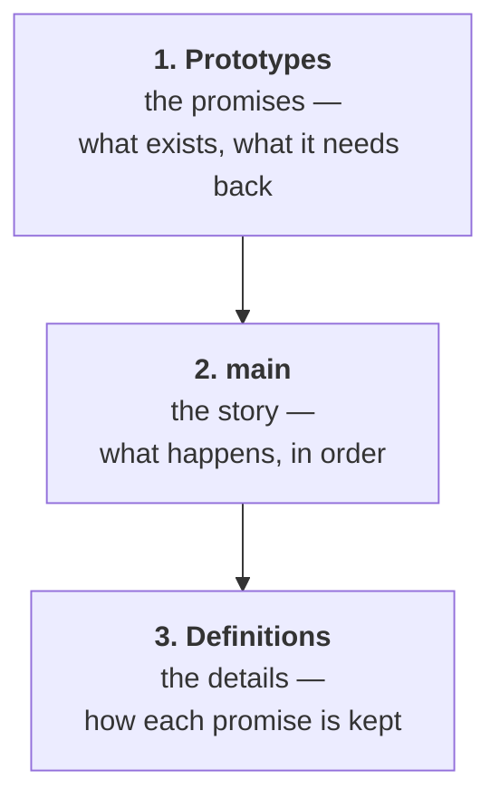

# Functions: The Same Program, Findable

## Learning Objectives

By the end of this reading, you will be able to:

- **Write** a program in the **full single-file form** — prototypes at the top, `main` in the middle, definitions at the bottom (MLO 6.1).
- **Define and call** a function with parameters and a return value (MLO 6.1).
- **Predict** whether a function can change the caller's variable, and **name** the difference as pass-by-value or pass-by-reference (MLO 6.2).
- **Explain** why one function cannot see another's local variables, and what to do instead.
- **Describe** what it means to refactor a program: same behaviour, better structure (MLO 6.3).

## Why This Matters

By the end of M5 you had a menu program that genuinely works. It loops, it validates, it refuses to crash when someone types a word into a number prompt. It is also **one function, about ninety lines long**, and you have already felt what that costs — scrolling past the whole gatekeeper to reach the one block you wanted to change.

Nothing about that program is wrong. It is just **undifferentiated**. Every line sits at the same level of importance, so finding anything means reading everything.

M6 is where the mass gets sorted. You will not learn a single new thing your programs can *do* in this module. You will learn how to say what they already do in pieces that have names — which turns out to be the difference between code you can revise and code you can only rewrite.

> **🔗 Connection**: This is M1's Robot Sandwich again. There, you broke a task into steps precise enough for a machine to follow. **A function is that step, made real** — named, reusable, and callable by that name.

## The Core Concept

### The shape of the file changes

Since M2 every program has looked the same way: includes at the top, everything else inside `main`. That was the **pre-M6 incomplete form**, and it was incomplete on purpose — there was nothing else to put anywhere.

From here on, a C++ file has three parts in a fixed order:



Here is the smallest program that has all three:

```cpp excerpt=modules/m6/code/learn-greet-function.cpp
// ===== 1. PROTOTYPES — what exists, and what it needs =====
void greet(string name);
int doubled(int value);

int main()
{
    // ===== 2. MAIN — reads like a summary, not a transcript =====
    greet("Bram");

    int torches = 6;
    cout << "Twice " << torches << " is " << doubled(torches) << ".\n";

    return 0;
}

// ===== 3. DEFINITIONS — how each promise is kept =====
void greet(string name)
{
    cout << "Well met, " << name << ".\n";
}

int doubled(int value)
{
    return value * 2;
}
```

**Program Output:**

```
Well met, Bram.
Twice 6 is 12.
```

**Why prototypes exist at all.** The compiler reads your file top to bottom, once. When it reaches `greet("Bram")` inside `main`, it has not seen the definition yet — that is forty lines further down. The prototype is the promise made in advance: *there will be a function called `greet`, it takes a `string`, it returns nothing.* That is enough for the compiler to check the call is sensible and carry on.

You could skip prototypes by putting every definition *above* `main`. Don't. `main` is the summary of what your program does, and a reader should reach it early — not after scrolling through every detail.

### Reading a function's first line

Everything you need to use a function is in one line:

| Part | In `int doubled(int value)` | Means |
|---|---|---|
| **Return type** | `int` | what it hands back |
| **Name** | `doubled` | what you call it |
| **Parameters** | `(int value)` | what it needs from you |

`void` in the return-type slot means *hands nothing back* — `greet` prints and that is all. A function with a real return type must `return` a value of that type, and the caller can use it anywhere a value fits, including in the middle of a `cout`.

### Predict first

**Both functions add ten. Only one of them changes `heroHp`. Read them, then write down the two printed numbers before you scroll.**

```cpp excerpt=modules/m6/code/learn-value-vs-reference.cpp
void addTenByValue(int hp);        // takes a COPY
void addTenByReference(int &hp);   // takes the VARIABLE ITSELF

int main()
{
    int heroHp = 50;

    addTenByValue(heroHp);
    cout << "After addTenByValue:     " << heroHp << '\n';

    addTenByReference(heroHp);
    cout << "After addTenByReference: " << heroHp << '\n';

    return 0;
}
```

<details>
<summary>Reveal the output</summary>

```
After addTenByValue:     50
After addTenByReference: 60
```

**The first call did nothing that lasted.** `addTenByValue` received a *copy* of `heroHp`. It added ten to the copy, the function ended, and the copy was thrown away. `heroHp` never knew.

**The second call reached the real variable.** The `&` in `int &hp` means *this parameter is the caller's variable, not a copy of it.* Change it and the change survives the return.

That single character is the whole difference. It is easy to miss when reading, and it is worth training your eye on now: **`int hp` is a copy, `int &hp` is the original.**
</details>

The names for these are worth knowing because you will see them in every language you meet next:

- **Pass by value** — the function gets a copy. Safe: it cannot damage anything you own.
- **Pass by reference** — the function gets your variable. Powerful, and easier to be surprised by.

**Default to by-value.** Reach for `&` when the function genuinely needs to change something the caller holds — which is less often than beginners expect, because a function that *returns* its answer is usually clearer than one that reaches out and edits.

### Every function has its own walls

Here is the planned error for this module, and it is one nearly everybody writes once.

```cpp excerpt=modules/m6/code/learn-break-scope.cpp
void announce();

int main()
{
    int torches = 6;
    announce();
    return 0;
}

void announce()
{
    cout << "You are carrying " << torches << " torches.\n";
}
```

`torches` is right there, a few lines up. The compiler disagrees:

```
learn-break-scope.cpp:27:36: error: 'torches' was not declared in this scope
```

**`torches` is local to `main`.** It exists while `main` runs and it is visible only inside `main`'s braces. `announce` is a different function with different walls, and it cannot see in. That is **scope**, and it is a feature: it is what stops a variable in one part of a program from being quietly clobbered by another.

The error is **Static semantic** — the grammar is fine, the meaning is impossible — so the compiler catches it and no program is built.

The fix is not to make `torches` reachable. **The fix is to pass it in**, which is what parameters are for:

```
void announce(int torches);   →   announce(torches);
```

### The payoff: same behaviour, better structure

Now the move this module is named for.

Your M5 menu program contained this, buried inside `main` — the loop that refuses to accept anything but a real number in range:

```cpp excerpt=modules/m6/code/learn-read-choice.cpp
int readChoice(int low, int high)
{
    int value = 0;
    cout << "Choose (" << low << "-" << high << "): ";

    while (!(cin >> value) || value < low || value > high)
    {
        cin.clear();
        cin.ignore(numeric_limits<streamsize>::max(), '\n');
        cout << "That is not a door. Choose " << low << "-" << high << ": ";
    }

    return value;
}
```

Nothing inside it is new. It is M5's validation loop, unchanged — **lifted out of `main` and given a name.** Now `main` says what it means:

```cpp excerpt=modules/m6/code/learn-read-choice.cpp
    int choice = readChoice(1, 3);
```

One line, and it reads as a sentence. A real run — the user types a word, then a number out of range, then a good one:

```
==== THE DUNGEON DOOR ====
1) Approach the gate
2) Hear the rules
3) Leave
Choose (1-3): door
That is not a door. Choose 1-3: 9
That is not a door. Choose 1-3: 2
You chose 2.
```

**Identical behaviour to M5.** Same rejection of `door`, same rejection of `9`, same acceptance of `2`. That is what makes it a **refactor** rather than a rewrite: the program's behaviour is the thing you are *not* allowed to change.

And it came with something free. `readChoice` takes `low` and `high` as parameters, so the *next* menu in your program does not need its own copy of this loop — it calls the same function with different numbers. **Code that has a name can be used twice.**

## Putting It Together

Three ideas, in the order they matter:

1. **The file has three parts now** — prototypes, `main`, definitions. `main` becomes a summary you can read.
2. **A function is a named step with a boundary.** It takes what it needs through parameters, hands back a result, and cannot see anyone else's locals.
3. **Refactoring is changing structure while holding behaviour still.** If the output changed, you did something other than refactor.

The program does not get smarter in this module. **You get faster at changing it**, and that is what the rest of the course is about to depend on.

## Common Questions

**How do I know when to make something a function?**
Two honest signals: you are about to copy and paste a block, or you find yourself writing a comment that says *what this section does*. That comment is a function name waiting to happen.

**Can a function call another function?**
Yes, and that is normal. `main` calls `readChoice`; `readChoice` could call something else. Each one only needs to know the ones it calls.

**Why does `readChoice` need `low` and `high` when M5 just hard-coded 1 and 3?**
It doesn't need them — it would work with the numbers baked in. Taking them as parameters is what makes it reusable for a *different* menu later, and reusability is most of what functions buy you.

**What if I get the prototype and the definition slightly different?**
The compiler tells you, usually bluntly. That is a **Static semantic** error — the promise and the delivery disagree — and it is caught before anything runs.

**Can I ask an AI to split my program into functions?**
You can, and it is good at the mechanical part. Check two things yourself: that the **behaviour did not change** — run it before and after and compare — and that each new function's name honestly describes what it does. A wrong name is worse than no function, because it is documentation that lies.

## Check Yourself

**1.** Where do the three parts of a C++ file go, in order?

<details><summary>Answer</summary>

**Prototypes** at the top, **`main`** in the middle, **definitions** at the bottom. The prototype lets the compiler check a call before it has read the definition.
</details>

**2.** `void heal(int hp)` is called as `heal(heroHp)`. Afterwards, has `heroHp` changed?

<details><summary>Answer</summary>

**No.** There is no `&`, so `heal` received a copy. To change the caller's variable the parameter would need to be `int &hp`.
</details>

**3.** You split a 90-line `main` into six functions. The program now prints one line in a different order than before. Did you refactor it?

<details><summary>Answer</summary>

**No.** A refactor holds behaviour still and changes only structure. Different output means you changed what the program does — that is a rewrite, and probably a bug. This is exactly why you run it before and after.
</details>

## Next Steps

1. **Take the M6 exit ticket.** It is completion-gated — finish it to move on. Nothing on it is a trick.
2. **Bring this reading to class** for the Apply session, where you will be handed a working program with the prototypes given and some function bodies missing, and write the definitions to match.
3. **Then the refactor lab**, which asks you to take your own M5 menu program and decompose it into functions — same behaviour, better structure.

> **📋 Instructor note — not yet authored.** M6 is at **First pass**: this reading
> exists; the exit ticket, the Apply session, and the refactor lab **do not yet
> exist** (ADR-016). Steps 1–3 describe where this beat hands off, not files you can
> open today. Do not route students here expecting the rest of the module to be
> waiting for them.
