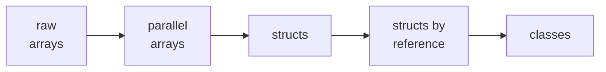

# Structured Data: When One Variable Is Not Enough

## Learning Objectives

By the end of this reading, you will be able to:

- **Declare, initialize, and traverse** an array, and say what the index means (MLO 7.1).
- **Explain** why parallel arrays work and why they are a stepping stone, not a destination.
- **Model** related data with a `struct` and **access** its members with `.` (MLO 7.2).
- **Pass a struct by reference** so a function can change the caller's copy (MLO 7.3).
- **Say** what a class adds to a struct, and why that is the last step of this module (MLO 7.4).

## Why This Matters

M6 sorted your *code* into named pieces. Your **data** is still loose.

Say your dungeon has three rooms. Each has a name, a hazard count, and whether it is lit. With what you know now that is nine separate variables — `room1Name`, `room1Hazards`, `room1Lit`, `room2Name`… and if a fourth room appears you write three more by hand.

That does not scale, and worse, **nothing in the program says those nine variables are related.** You know Room 2's three variables belong together. The compiler has no idea.

This module fixes both problems, in a deliberate order: **arrays** hold many of one thing, then **structs** bundle related things, then **classes** let a bundle carry behaviour too. Each step is a real answer to a problem the previous step leaves you with.



This reading walks the first four. **Classes are the destination**, and the rest of the module goes there.

## The Core Concept

### An array is many values under one name

```cpp excerpt=modules/m7/code/learn-rooms-array.cpp
    const int ROOM_COUNT = 4;
    int hazards[ROOM_COUNT] = {0, 2, 1, 5};   // hazards in each room
```

`hazards` is four `int`s in a row. You reach each one by **index** — its position, counting from zero:

| Index | `hazards[i]` |
|---|---|
| `0` | 0 |
| `1` | 2 |
| `2` | 1 |
| `3` | 5 |

**Counting from zero is the whole difficulty of arrays**, and it produces one specific mistake so often that it has a name. Four items means valid indexes `0`, `1`, `2`, `3` — **the last index is one less than the count.** There is no `hazards[4]`.

### Predict first

**This loop walks the array. Read it and write down every line it prints — how many lines, and what numbers — before you scroll.**

```cpp excerpt=modules/m7/code/learn-rooms-array.cpp
    for (int i = 0; i < count; i++)
    {
        // i is WHERE we are. hazards[i] is WHAT is there.
        cout << "Room " << i << " holds " << hazards[i] << " hazards.\n";
    }
```

<details>
<summary>Reveal the output</summary>

```
Room 0 holds 0 hazards.
Room 1 holds 2 hazards.
Room 2 holds 1 hazards.
Room 3 holds 5 hazards.
```

**Four lines, and the first room is Room 0.** Two things people get wrong here:

**`i` and `hazards[i]` are different things.** `i` is *where you are*; `hazards[i]` is *what is there*. Room 1 holds 2 hazards — the `1` and the `2` come from different places. Reading `i` when you meant the value is the most common array bug there is.

**`i < count`, not `i <= count`.** With four items, `i` must stop at 3. Write `<=` and the loop reaches for `hazards[4]`, which does not exist — and C++ will not stop you. It reads whatever happens to sit in memory next and carries on with a nonsense number. **No crash, no message.** That is a **Logic** error the compiler cannot see, and it is why the off-by-one matters more here than anywhere else in the course.
</details>

### Parallel arrays: the honest stepping stone

A room is not just a hazard count. It has a name and a lit-ness too. The first thing that *works* is one array per attribute:

```cpp excerpt=modules/m7/code/learn-parallel-arrays.cpp
    string names[ROOM_COUNT]  = {"Entry Hall", "Flooded Vault", "Torch Room"};
    int    hazards[ROOM_COUNT] = {0, 2, 1};
    bool   lit[ROOM_COUNT]     = {true, false, true};
```

**Program Output:**

```
Entry Hall: 0 hazards, lit.
Flooded Vault: 2 hazards, dark.
Torch Room: 1 hazards, lit.
```

These are **parallel arrays**: three arrays where index `1` means the same room in all three. It works, and you should be able to read it, because plenty of real code looks like this.

Now notice what is holding it together: **nothing but agreement.** The only thing making `names[1]`, `hazards[1]` and `lit[1]` the same room is that everybody remembers to use the same index. Sort one array and not the others and the dungeon quietly scrambles — the Flooded Vault keeps the Torch Room's hazards, and no tool will tell you.

Look at that function signature too:

```cpp excerpt=modules/m7/code/learn-parallel-arrays.cpp
void listRooms(const string names[], const int hazards[], const bool lit[], int count);
```

Four parameters to describe one thing. Add a `visited` flag and every signature grows again.

### Structs: the three arrays collapse into one

A `struct` says *these fields belong together* — and then C++ knows it too.

```cpp excerpt=modules/m7/code/learn-room-struct.cpp
struct Room
{
    string name;
    int hazards;
    bool lit;
};
```

That is a new type. Now one array holds whole rooms:

```cpp excerpt=modules/m7/code/learn-room-struct.cpp
    Room rooms[ROOM_COUNT] = {
        {"Entry Hall",    0, true},
        {"Flooded Vault", 2, false},
        {"Torch Room",    1, true}
    };
```

Reach a field with a dot: `rooms[i].name`, `rooms[i].hazards`. And the signature that took four parameters takes two:

```cpp excerpt=modules/m7/code/learn-room-struct.cpp
void listRooms(const Room rooms[], int count);
```

**The output is byte-for-byte identical to the parallel-array version.** That is the point, and it should feel familiar — it is exactly what M6 called a **refactor**: behaviour held still, structure improved. Same lesson, now applied to data instead of code.

What changed is what the program can no longer get wrong. There is no way to sort the names out of step with the hazards, because they are not separate things any more.

### Passing a struct so a function can change it

M6 taught you that `&` makes a parameter *the caller's variable* rather than a copy. Structs are where that starts to matter constantly:

```cpp excerpt=modules/m7/code/learn-room-struct.cpp
void lightTorch(Room &room)
{
    room.lit = true;
}
```

Called as `lightTorch(rooms[1])`, that reaches into the array and changes the real room:

```
You strike a torch in the vault.

Entry Hall: 0 hazards, lit.
Flooded Vault: 2 hazards, lit.
Torch Room: 1 hazards, lit.
```

Drop the `&` and the Flooded Vault stays dark forever — the function would light a copy and throw it away. **That is the same bug M6 warned about, and it is much easier to miss on a struct**, because the code reads as if it worked.

> **💡 Pro Tip**: You will also see `const Room rooms[]` above. `const` is a promise that this function only *reads*. Break the promise and the compiler stops you — which is a rare thing in this course: a mistake caught by the machine rather than by you.

### The planned error: a field that is not there

```cpp excerpt=modules/m7/code/learn-break-member.cpp
    Room entry = {"Entry Hall", 0, true};

    cout << entry.torches << '\n';
```

`Room` has `name`, `hazards`, and `lit`. It has no `torches`:

```
learn-break-member.cpp:28:19: error: 'struct Room' has no member named 'torches'
```

A **Static semantic** error — the grammar is fine, the meaning is impossible — caught at compile time, so no program is built. This is one of the friendlier ones: the compiler names the type *and* the field it could not find, so a typo is usually obvious the moment you read it.

### What a class adds

A `struct` holds data. A **class** holds data *and the behaviour that belongs to it* — so instead of a loose `lightTorch(room)` function sitting somewhere else in the file, the room knows how to light itself.

That is the last step of this module, and the rest of M7 goes there. The line worth remembering now: **a class is a struct that also has behaviour.**

## Putting It Together

The progression, and the problem each step solves:

| Step | Fixes | Leaves you with |
|---|---|---|
| **Array** | Many values, one name | No way to relate *different kinds* of data |
| **Parallel arrays** | Relating them, by index | A relationship only humans can see |
| **Struct** | Making the relationship real | Data with no behaviour attached |
| **Class** | Behaviour that belongs to the data | — |

Each step is a fix for the previous step's specific problem. **That is why the order matters, and why parallel arrays are taught rather than skipped** — you cannot appreciate what a struct buys you until you have felt what it costs not to have one.

## Common Questions

**Why do arrays start at zero?**
Because the index is really *how far from the start*, and the first item is zero steps in. It stops being strange after a couple of weeks, and every mainstream language does it.

**What happens if I read past the end of an array?**
Something. Not a crash, usually — you get whatever was in that memory. That is the danger: it looks like a number, so the program carries on and lies to you. Guard the loop bound; that is the whole defence at this level.

**When do I use a struct instead of separate variables?**
When the values describe **one thing** and travel together. If you keep passing the same three variables into the same functions, they wanted to be a struct.

**Do I need `&` on every struct parameter?**
No. Use `&` when the function must **change** the caller's struct. Use `const Type&` when it only reads one — that avoids copying without allowing changes. Plain by-value is fine for small structs you do not need to modify.

**Can an AI write my struct for me?**
It will, and it will probably be reasonable. The thing to check yourself: **do the fields actually describe one thing?** A struct that has collected unrelated fields is worse than three variables, because it looks organised while being a junk drawer.

## Check Yourself

**1.** `int scores[5];` — what is the last valid index?

<details><summary>Answer</summary>

**`4`.** Five items, counting from zero, so `0`–`4`. `scores[5]` is off the end — and C++ will let you write it.
</details>

**2.** You have parallel arrays for names and hazards, and you sort only the names. What breaks?

<details><summary>Answer</summary>

**Every room's hazard count is now attached to the wrong name.** Nothing errors, nothing warns — the arrays are still perfectly valid, they just no longer agree. This is exactly the failure a struct makes impossible.
</details>

**3.** `void heal(Room room)` sets `room.lit = true`. Afterwards, is the caller's room lit?

<details><summary>Answer</summary>

**No.** There is no `&`, so `heal` got a copy and lit the copy. It needs `Room &room`. This is the M6 lesson again, and it hides better on a struct because the code looks like it worked.
</details>

## Next Steps

1. **Take the M7 exit tickets.** They are completion-gated — finish them to move on. Nothing on them is a trick.
2. **Bring this reading to class** for the Apply session, where you will build a `Room` struct array together and then finish the methods of a partly-written `Hero` class.
3. **Then the lab**, which starts by refactoring parallel arrays into a struct array — and builds from there.

> **📋 Instructor note — not yet authored.** M7 is at **First pass**: this reading
> exists; the exit tickets, the Apply session, and the lab **do not yet exist**
> (ADR-016). Steps 1–3 describe where this beat hands off, not files you can open
> today. Do not route students here expecting the rest of the module to be waiting
> for them.
