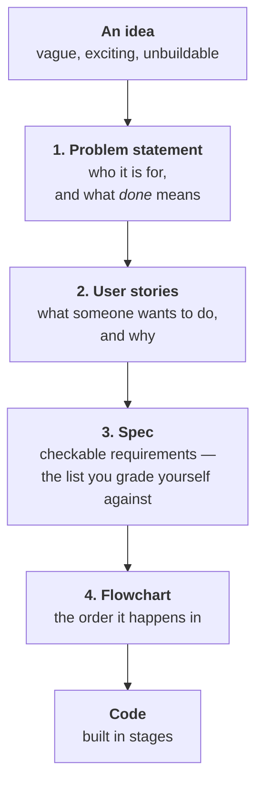
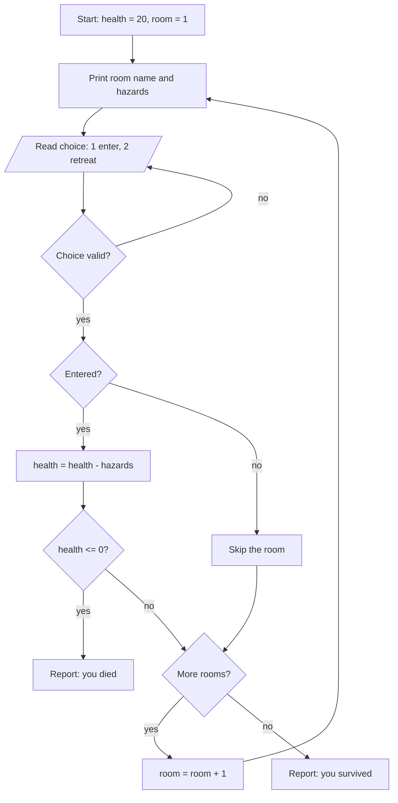

# Knowing What to Build: The Design Document

## Learning Objectives

By the end of this reading, you will be able to:

- **Write** a problem statement that names who the program is for and what *done* means (MLO 8.1).
- **Turn** a problem statement into **user stories** in the "As a… I want… so that…" shape (MLO 8.1).
- **Turn** user stories into a **spec** — requirements someone else can check without asking you (MLO 8.1).
- **Draw** the flowchart for your spec's main path, using M2's shapes (MLO 8.1).
- **Plan** an implementation as **stages**, where every stage compiles and runs on its own (the *planning* half of MLO 8.2).

**Scope note.** This reading is the front half of M8 — the design document. Actually
building the capstone (MLO 8.2), testing it against your own spec (MLO 8.3), and
presenting and defending it (MLO 8.4) happen in the capstone itself, not here.

## Why This Matters

Look back at what every module handed you.

M2 handed you a program and asked you to type it. M4 handed you the gatekeeper.
M5 handed you the same gatekeeper with a loop around it. M6 handed you a
ninety-line `main` and told you which pieces to pull out. M7 handed you a `Room`
struct and three rooms to put in it.

**Somebody had already decided what to build. Every single time.**

M8 is where that stops. Nobody hands you a program. You write the problem down
yourself, decide what counts as finished, and then build it — and the design
document is graded before you are allowed to write a line of code.

That ordering is not bureaucracy. It is the whole point of the module, and it is
M0's opening claim finally cashed in: **an AI is only as good as the problem you
hand it.** Ask for "a dungeon game" and you get *a* dungeon game — some dungeon
game, not yours, and you will not be able to tell whether it is right, because
you never said what right was.

> **🔗 Connection**: This is M1's Robot Sandwich, grown up. There you wrote
> instructions precise enough for someone with no common sense to follow. Here
> you write a spec precise enough that **you** can tell, later and honestly,
> whether the thing you built is the thing you meant.

## The Core Concept

### Four parts, in order

A design document has four parts, and they narrow as you go. Each one is built
from the one before it.



Read that top to bottom and notice what it does: it takes something you cannot
argue with — an idea — and turns it into something you *can*. By the bottom of
the funnel, disagreement about whether the program is finished is a disagreement
about a written line, not about a feeling.

### 1. The problem statement

One paragraph. Three jobs: **who** it is for, **what** they can do with it, and
**how you will know it is done.**

Here is one that fails all three:

> A dungeon game where you explore rooms and fight monsters. It should be fun.

Nothing there can be checked. How many rooms? Fight them how? And "fun" is not a
finish line — you can always add more fun, which means you can never stop.

Here is the same idea, stated:

> A single-player console dungeon crawler for a CSC-134 student to run in a
> terminal. The player moves through a fixed set of three rooms, choosing at each
> one whether to enter or retreat, and each room subtracts hazard damage from the
> hero's health. **It is done when** the player can reach the last room or die
> trying, and the program reports which happened.

That is buildable. It is also *smaller* than the first one, and that is a
feature. **The first honest thing a problem statement does is make the project
finite.**

### 2. User stories

A user story says what someone wants and why, in one sentence:

> **As a** \<who\>, **I want** \<what\>, **so that** \<why\>.

Three for the dungeon:

> **As a** player, **I want** to see the room's name and hazard count before I
> choose, **so that** my choice is a real decision instead of a guess.
>
> **As a** player, **I want** to retreat from a room, **so that** a bad draw is
> not an automatic death.
>
> **As a** player, **I want** to see my health after every room, **so that** I
> can tell how close I am to losing.

The "so that" is the part everyone skips, and it is the part that pays. It tells
you **when a feature is finished** — the first story is done when the choice is
informed, not when the room description is beautiful. It also tells you when a
feature should be *cut*: if you cannot finish the "so that" clause honestly, you
have found a feature that exists because it sounded good.

### 3. The spec

User stories are wishes. A spec is the list you can be graded against.

Take the first story and turn it into requirements:

> - **R1.** Before each choice, the program prints the room's name.
> - **R2.** Before each choice, the program prints the room's hazard count as a whole number.
> - **R3.** The program then prompts for a choice and accepts only `1` (enter) or `2` (retreat).
> - **R4.** Any other input reprompts without crashing and without advancing the room.

Apply one test to every line you write: **could someone who has never spoken to
you tell whether your program does it?** R1 through R4 pass. "The room feels
dangerous" does not.

R4 should look familiar — it is the M5 input-validation loop, which by M6 you
had lifted into a function called `readChoice`. **Most of your spec will be made
of things you already know how to build.** That is what eight modules bought you.

### 4. The flowchart

Now draw it, with M2's shapes: rectangles for steps, a diamond for every
decision. This is the main path of the spec above.



Drawing this is where design documents earn their keep, because **the diagram
asks questions the prose let you dodge.** That `H` diamond is one: does retreating
skip the damage check entirely? The prose never said. The flowchart could not
avoid saying, so you had to decide — and you decided it for free, in a diagram,
instead of two hours into a debugging session.

### Then: build it in stages

You have a design. You do not write it all at once.

**A stage is a version of the program that compiles and runs on its own.** Not a
sketch, not a file full of `// TODO` — a program you can hand to someone.

Here is stage 1 of the dungeon above. One room, printed. That is all it does,
and it does it completely:

```cpp source=modules/m8/code/learn-stage1-one-room.cpp
// M8 Learn — staged build, STAGE 1: one room, printed.
// Compiles and runs on its own. Nothing here is placeholder.
#include <iostream>
#include <string>
using namespace std;

void describeRoom(string name, int hazards);

int main()
{
    describeRoom("The Damp Corridor", 2);
    return 0;
}

void describeRoom(string name, int hazards)
{
    cout << "== " << name << " ==\n";
    cout << "Hazards here: " << hazards << "\n";
}
```

**Program Output:**

```
== The Damp Corridor ==
Hazards here: 2
```

That is R1 and R2, done and provable. Nothing else is even attempted yet.

### Predict first

**Stage 2 grows one room into three. Read it, then write down the last line it
prints before you scroll.**

```cpp source=modules/m8/code/learn-stage2-rooms-array.cpp
// M8 Learn — staged build, STAGE 2: three rooms in an array, and a total.
// Stage 1's behaviour is still here. This one also compiles and runs on its own.
#include <iostream>
#include <string>
using namespace std;

struct Room
{
    string name;
    int hazards;
};

void describeRoom(Room room);

int main()
{
    Room dungeon[3] = {
        {"The Damp Corridor", 2},
        {"The Collapsed Stair", 1},
        {"The Gatekeeper's Hall", 4}
    };

    int total = 0;
    for (int i = 0; i < 3; i++)
    {
        describeRoom(dungeon[i]);
        total += dungeon[i].hazards;
    }

    cout << "Hazards in the whole dungeon: " << total << "\n";
    return 0;
}

void describeRoom(Room room)
{
    cout << "== " << room.name << " ==\n";
    cout << "Hazards here: " << room.hazards << "\n";
}
```

<details>
<summary>Reveal the output</summary>

```
== The Damp Corridor ==
Hazards here: 2
== The Collapsed Stair ==
Hazards here: 1
== The Gatekeeper's Hall ==
Hazards here: 4
Hazards in the whole dungeon: 7
```

`2 + 1 + 4` is `7`. Stage 1's two lines are still the first two lines — the
program grew, it did not restart.
</details>

Notice that stage 2 changed `describeRoom`'s parameters, from two loose values to
one `Room`. **That is allowed.** Stages are permitted to change shape as they
grow; that is ordinary M6 refactoring. The one rule a stage cannot break is that
it compiles and runs when you stop working on it.

Why bother? Because a program that has compiled and run at every step **has never
been broken for longer than one change.** When stage 4 fails, the bug is in stage
4 — you had a working program ten minutes ago. Students who write all 200 lines
and then compile once are debugging 200 lines simultaneously, and they are the
ones who end up rewriting from scratch.

### The error the compiler cannot catch

M2 gave you four words for four kinds of wrong: **Syntax**, **Static semantic**,
**Runtime**, and **Logic**. Every module since has practised the first three, and
your tools have gotten better at all three. The compiler catches Syntax and
Static semantic before your program exists. Runtime failures announce themselves
by falling over.

**Logic** — did what you said, not what you meant — is the one nothing catches.
It compiles. It runs. It is wrong.

That is exactly the error a capstone is built to expose, and exactly the one an
AI assistant cannot save you from, because it will faithfully implement whatever
you asked for. **The spec is what turns a Logic error into a checkable
disagreement:** without R4 written down, "the program crashes when I type `door`"
is a matter of opinion about what the program was supposed to do. With R4 written
down, it is a failed requirement, and you know it in five seconds.

That is the module's whole bargain. You write down what right means *before* you
can be tempted to define right as whatever you happened to build.

## Putting It Together

1. **Problem statement → user stories → spec → flowchart.** Each step turns
   something arguable into something checkable.
2. **A spec line passes only if a stranger could check it.** If checking it
   requires asking you what you meant, it is not a requirement yet.
3. **Build in stages that each compile and run.** Never be more than one change
   away from a working program.
4. **The design document is the part AI cannot do for you** — along with standing
   behind the result. That is why it is graded first and graded hard.

## Common Questions

**How long should the design document be?**
Short enough to read in one sitting. A paragraph of problem statement, three to
six user stories, ten to twenty spec lines, one flowchart. Length is not the
grade — checkability is.

**What if I discover halfway through that my spec was wrong?**
Change it, and say you changed it. Specs are meant to be revised when you learn
something; what is not allowed is quietly editing the spec to match whatever the
code already does, then calling it finished. That is grading yourself after
moving the target.

**Can I use AI to help write the design document?**
You can use it to sharpen wording, spot a missing case, or argue with your
flowchart. What you cannot outsource is the deciding — which problem, which
users, what *done* means. You will be asked to defend those choices, and "the AI
suggested it" is not a defense. Whatever assistance you use, document it; that is
MLO 8.4, and it is a disclosure requirement, not a penalty.

**How do I pick the stages?**
Order them so the earliest stage proves the riskiest thing. If you have never
written the file-of-rooms logic before, that is stage 1 or 2 — not stage 6, where
discovering it is hard leaves you no time.

**Does the dungeon theme have to stay?**
No. Every skin the course has used is removable — the decisions underneath are
what matter. Build a coffee shop order queue or a gym workout logger if you
prefer; the design document is graded on the same four parts either way.

## Check Yourself

**1.** Which of these is a usable spec line? *(a)* "The program handles bad input
gracefully." *(b)* "If the input is not `1` or `2`, the program reprints the
prompt and does not advance the room."

<details><summary>Answer</summary>

**(b).** A stranger can run the program, type `q`, and check it. "Gracefully" has
no test — two reasonable people would grade it differently.
</details>

**2.** Your stage 3 does not compile, so you keep going and plan to fix it in
stage 4. What rule did you break, and what does it cost you?

<details><summary>Answer</summary>

**A stage must compile and run on its own.** The cost is that when stage 4 breaks,
you no longer know which stage broke it — you have lost your last known-good
program, which is the entire reason for staging.
</details>

**3.** Your program compiles, runs, never crashes, and awards the player health
for entering hazardous rooms instead of subtracting it. Which of the four error
words is this, and which document should have caught it?

<details><summary>Answer</summary>

**Logic** — it did what you said, not what you meant. The **spec** should have
caught it: a requirement saying health *decreases* by the hazard count turns this
from an opinion into a failed check.
</details>

## Next Steps

1. **Draft your design document** — problem statement, user stories, spec,
   flowchart — and submit it before you write code. It is graded before
   implementation opens.
2. **Plan your stages**, riskiest thing first, and keep every one of them
   compiling.
3. **Then build, test against your own spec, and present it** — including a note
   on any AI assistance you used.

> **📋 Instructor note — not yet authored.** M8 is at **First pass**: this reading
> exists; the design-document brief, the capstone spec, the staged-build
> requirements, and the capstone rubric **do not yet exist** (ADR-016). Steps 1–3
> describe where this beat hands off, not files you can open today. Do not route
> students here expecting the rest of the module to be waiting for them.
